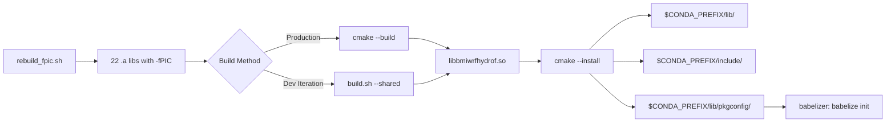
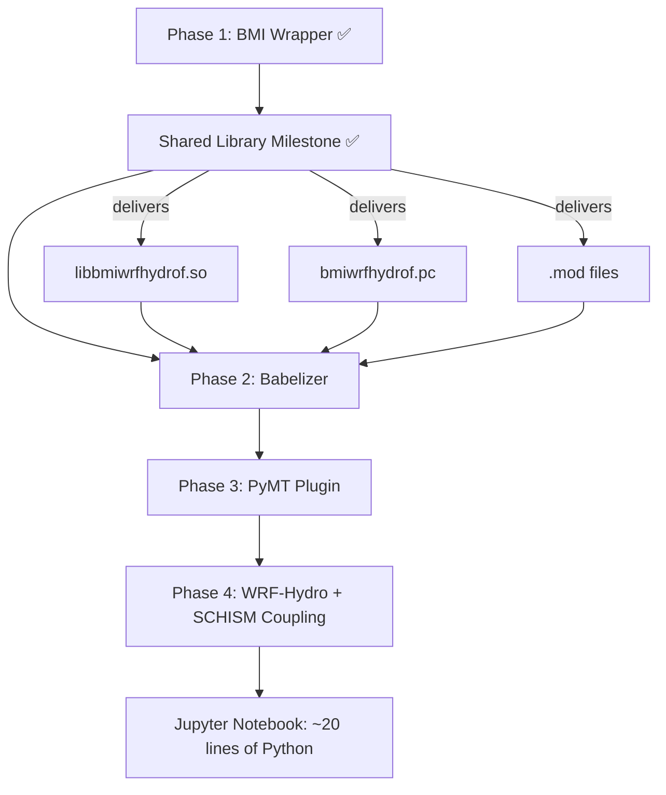

# 🔧 Doc 16: Shared Library & Babelizer Readiness -- Complete Guide

> **From Fortran to Python in 5 layers** -- This guide covers how we turned the WRF-Hydro BMI wrapper
> (bmi_wrf_hydro.f90) into a shared library (libbmiwrfhydrof.so) ready for the CSDMS babelizer to
> auto-generate the full Python binding (`pymt_wrfhydro`).
>
> **Phase 5 Update (Feb 2026):** The hand-written C binding layer (`bmi_wrf_hydro_c.f90`) and Python ctypes tests were **removed** in Phase 5. The babelizer auto-generates its own C interop layer (`bmi_interoperability.f90`), making our hand-written C bindings redundant and harmful (duplicate symbol conflicts). Sections 5-7 are retained as **historical reference** only.

---

## 📑 Table of Contents

- [Section 1: 🌟 Introduction & Big Picture](#section-1--introduction--big-picture)
- [Section 2: 🏗️ Architecture Overview](#section-2-️-architecture-overview)
- [Section 3: 🔨 Phase 1 -- fPIC Foundation](#section-3--phase-1----fpic-foundation)
- [Section 4: 📦 Phase 2 -- Shared Library Build](#section-4--phase-2----shared-library-build)
- [Section 5: 🔗 Phase 3 -- Minimal C Binding Layer (HISTORICAL)](#section-5--phase-3----minimal-c-binding-layer-historical)
- [Section 6: 🐍 Python ctypes Usage (HISTORICAL)](#section-6--python-ctypes-usage-historical)
- [Section 7: 🧪 Python Test Suite (HISTORICAL)](#section-7--python-test-suite-historical)
- [Section 8: 🔍 Key Technical Decisions](#section-8--key-technical-decisions)
- [Section 9: 🚀 Babelizer Readiness](#section-9--babelizer-readiness)
- [Section 10: ⚔️ SCHISM Comparison -- Two Paths to Python](#section-10-️-schism-comparison----two-paths-to-python)
- [Section 11: 📊 Performance & Metrics](#section-11--performance--metrics)
- [Section 12: 🛠️ Troubleshooting](#section-12-️-troubleshooting)
- [Section 13: 📁 Complete File Reference](#section-13--complete-file-reference)
- [Section 14: 🗺️ What's Next -- The Babelizer Journey](#section-14-️-whats-next----the-babelizer-journey)
- [Section 15: 📋 Quick Reference Card](#section-15--quick-reference-card)
- [Section 16: 📝 Summary](#section-16--summary)

---

## Section 1: 🌟 Introduction & Big Picture

### 1.1 What This Doc Covers

This document covers the journey from a working Fortran BMI wrapper (`bmi_wrf_hydro.f90`, 1,919 lines, 41 BMI functions) to a **shared library** (`libbmiwrfhydrof.so`, 4.9 MB) that Python can load and call directly. It also documents what the **babelizer** needs from us to auto-generate the full Python package (`pymt_wrfhydro`).

This was accomplished across 4 phases:

| Phase | Name | Key Output |
|-------|------|------------|
| Phase 1 | 🔨 fPIC Foundation | 22 WRF-Hydro static libs rebuilt with `-fPIC` |
| Phase 2 | 📦 Shared Library Build | `libbmiwrfhydrof.so` via CMake + `build.sh --shared` |
| Phase 3 | ~~🔗 C Binding + Python Tests~~ | ~~10 `bind(C)` functions + 8 pytest tests~~ **(Removed in Phase 5 -- babelizer generates its own)** |
| Phase 4 | 📄 Documentation | This doc (Doc 16) |

### 1.2 Where We Are in the 5-Layer Architecture

The WRF-Hydro BMI project follows a 5-layer architecture. This document covers **Layer 2.5** -- the bridge between the BMI wrapper (Layer 2) and the babelized Python plugin (Layer 3):

```
┌─────────────────────────────────────────────────────┐
│  Layer 5: Scientist / Jupyter Notebook              │  <-- ~20 lines of Python
├─────────────────────────────────────────────────────┤
│  Layer 4: PyMT Framework                            │  <-- Grid mapping, time sync
├─────────────────────────────────────────────────────┤
│  Layer 3: Babelized Plugin (pymt_wrfhydro)          │  <-- Auto-generated by babelizer
├─────────────═══════════════════════════─────────────┤
│  Layer 2.5: Shared Library + pkg-config             │  <-- ★ THIS DOC ★
│  ┌─────────────────────────────────────────┐        │
│  │ libbmiwrfhydrof.so                      │        │
│  │  ├── bmi_wrf_hydro.f90 (BMI wrapper)    │        │
│  │  ├── hydro_stop_shim.f90 (linker shim)  │        │
│  │  └── 22 WRF-Hydro static libs (baked in)│        │
│  └─────────────────────────────────────────┘        │
├─────────────────────────────────────────────────────┤
│  Layer 2: BMI Wrappers + Standard Names             │  <-- Doc 15
├─────────────────────────────────────────────────────┤
│  Layer 1: Original Models (WRF-Hydro + SCHISM)      │  <-- Doc 14
└─────────────────────────────────────────────────────┘
```

> 🧠 **Key insight:** Layer 2.5 is the **gateway to Python**. Without a shared library, the babelizer has nothing to wrap. Without pkg-config, the babelizer can't find the library. This layer is small in code but critical in architecture.

### 1.3 ML Analogy

> 🤖 **ML Analogy:** The shared library is like **exporting a trained PyTorch model to ONNX format** -- it packages the model (WRF-Hydro BMI wrapper) so that other frameworks (Python ctypes, babelizer, PyMT) can load and run it without needing the original training code (Fortran compiler, WRF-Hydro source tree).
>
> Just as ONNX standardizes model interchange, the `.so + .pc + .mod` trio standardizes how Fortran BMI models are discovered and loaded by the CSDMS ecosystem.

### 1.4 Prerequisites

Before reading this doc, you should be familiar with:

- **BMI basics** -- What the 41 BMI functions do and why they exist (see **Doc 2**: BMI Complete Detailed Guide)
- **The WRF-Hydro BMI wrapper** -- How `bmi_wrf_hydro.f90` implements the 41 functions (see **Doc 15**: BMI Build & Test Complete Guide)
- **Conda environment** -- The `wrfhydro-bmi` conda environment with gfortran, MPI, NetCDF, and bmi-fortran 2.0.3

### 1.5 Terminology

| Term | Meaning |
|------|---------|
| `.so` | Shared Object -- a dynamically linkable library (Linux equivalent of `.dll` on Windows) |
| `-fPIC` | Position-Independent Code -- compiler flag that makes code relocatable in memory |
| `bind(C)` | Fortran 2003 attribute that exports a function with C-compatible calling convention |
| `pkg-config` | A tool that helps build systems find installed libraries (flags, paths, dependencies) |
| `ctypes` | Python standard library module for calling C-compatible functions in shared libraries |
| Babelizer | CSDMS tool that auto-generates Python bindings for Fortran BMI models |
| PyMT | Python Modeling Toolkit -- CSDMS framework for coupling Earth system models |

---

## Section 2: 🏗️ Architecture Overview

### 2.1 What's in the Shared Library

`libbmiwrfhydrof.so` is a single file that contains **everything** needed to run WRF-Hydro through the BMI interface:

```
libbmiwrfhydrof.so (4.8 MB)
├── bmi_wrf_hydro.f90      BMI wrapper: 41 functions, CSDMS names, grid mapping
├── hydro_stop_shim.f90    Linker shim: resolves bare external symbol
└── 22 WRF-Hydro .a libs   Entire model: Noah-MP, routing, channel, I/O
    (Note: bmi_wrf_hydro_c.f90 was removed in Phase 5 -- babelizer generates its own C interop)
    ├── libhydro_routing.a
    ├── libnoahmp_util.a
    ├── libhydro_mpp.a
    ├── ... (19 more)
    └── libcrocus_surfex.a
```

The 22 WRF-Hydro static libraries are **baked into** the shared library using `--whole-archive`. This means downstream consumers (Python, babelizer) only need `libbmiwrfhydrof.so` -- no separate WRF-Hydro installation required.

> 🧠 **Key insight:** The shared library is self-contained. A Python script can load it with `ctypes.CDLL("libbmiwrfhydrof.so")` and immediately call BMI functions. No Fortran compiler, no WRF-Hydro source tree, no additional `.a` files needed at runtime.

### 2.2 Why a Shared Library?

Static libraries (`.a`) require the consumer to recompile and relink. Shared libraries (`.so`) enable **dynamic loading** at runtime:

| Feature | Static Library (`.a`) | Shared Library (`.so`) |
|---------|----------------------|------------------------|
| Loading | Compile-time only | Runtime (`dlopen`, `ctypes.CDLL`) |
| Consumer language | Same language (Fortran) | Any language with FFI (Python, C, C++) |
| Babelizer | Cannot use | Required (`pkg-config --libs`) |
| File size | One `.a` per module | Single self-contained file |
| Symbol visibility | Internal | Exported (visible to `nm -D`) |

> 🤖 **ML Analogy:** Static library = source code you must compile with your project (like training from scratch). Shared library = pre-compiled model checkpoint you just load (like `torch.load("model.pt")`).

### 2.3 File Inventory

| File | Lines | Purpose | Phase Created |
|------|-------|---------|---------------|
| `bmi_wrf_hydro.f90` | 1,919 | Main BMI wrapper (41 functions) | Pre-existing |
| ~~`bmi_wrf_hydro_c.f90`~~ | ~~335~~ | ~~C binding layer (10 functions)~~ **REMOVED Phase 5** | ~~Phase 3~~ |
| `hydro_stop_shim.f90` | 28 | Linker symbol resolver | Phase 2 |
| `CMakeLists.txt` | 447 | CMake build configuration | Phase 2 |
| `bmiwrfhydrof.pc.cmake` | 11 | pkg-config template | Phase 2 |
| `rebuild_fpic.sh` | ~80 | Rebuild WRF-Hydro with -fPIC | Phase 1 |
| `build.sh` (updated) | ~250 | Dev builds with --fpic/--shared + auto-install | Phase 1-2, updated Phase 5 |
| ~~`conftest.py`~~ | ~~181~~ | ~~Pytest fixtures~~ **REMOVED Phase 5** | ~~Phase 3~~ |
| ~~`test_bmi_python.py`~~ | ~~312~~ | ~~Python test suite (8 tests)~~ **REMOVED Phase 5** | ~~Phase 3~~ |

### 2.4 Build Pipeline Flow



The pipeline has two paths:

1. **Production (CMake):** Full project build with proper versioning, installation, and pkg-config generation. Use this for the final library that babelizer consumes.
2. **Development (`build.sh --shared`):** Quick iteration during development. Skips cmake overhead, builds directly with gfortran, auto-runs tests.

---

## Section 3: 🔨 Phase 1 -- fPIC Foundation

### 3.1 What is -fPIC and Why It's Needed

Every piece of code that goes into a shared library must be compiled as **Position-Independent Code** (PIC). Without it, the code assumes it will be loaded at a fixed memory address, which conflicts with shared library loading.

The `-fPIC` flag tells the compiler to generate code that works correctly regardless of where in memory it ends up:

```
Without -fPIC:                     With -fPIC:
┌──────────────────┐              ┌──────────────────┐
│ Code at 0x400000 │              │ Code at ANY addr  │
│ MOV 0x400100, %eax│             │ MOV [RIP+0x100]  │
│ (absolute addr)  │              │ (relative addr)   │
└──────────────────┘              └──────────────────┘
    ✗ Fails in .so                    ✓ Works in .so
```

> 🤖 **ML Analogy:** -fPIC is like making your code **containerized** -- it can run at any address (like a Docker container on any host), rather than being hardcoded to a specific machine (like a bare-metal install). A shared library is like a container image: it must be portable.

### 3.2 How rebuild_fpic.sh Works

WRF-Hydro's original build (`wrf_hydro_nwm_public/build/`) was compiled **without** explicit `-fPIC`. We cannot modify WRF-Hydro's CMakeLists.txt (non-invasive rule), so we created a wrapper script:

```bash
# rebuild_fpic.sh -- Rebuild WRF-Hydro with explicit -fPIC
cmake .. \
  -DCMAKE_BUILD_TYPE=Release \
  -DCMAKE_POSITION_INDEPENDENT_CODE=ON \    # <-- The key flag
  -DCMAKE_Fortran_COMPILER=gfortran \
  -DCMAKE_C_COMPILER=gcc \
  -DCMAKE_CXX_COMPILER=g++

make -j$(nproc)
```

The flag `CMAKE_POSITION_INDEPENDENT_CODE=ON` tells CMake to add `-fPIC` to all **library** targets. This produces 22 static libraries in `build_fpic/lib/` alongside the original `build/lib/`:

```
wrf_hydro_nwm_public/
├── build/           # Original build (no explicit -fPIC)
│   └── lib/         # 22 .a files (may have R_X86_64_32S relocations)
├── build_fpic/      # fPIC rebuild
│   ├── lib/         # 22 .a files (zero R_X86_64_32S relocations) ✓
│   └── mods/        # .mod files from fPIC build
└── src/             # WRF-Hydro source (untouched)
```

### 3.3 Verification

To verify that all relocations are PIC-compatible (no absolute 32-bit addresses):

```bash
# Count problematic relocations (should be 0 for each library)
for lib in wrf_hydro_nwm_public/build_fpic/lib/*.a; do
  count=$(readelf -r "$lib" 2>/dev/null | grep -c R_X86_64_32S)
  echo "$count  $(basename $lib)"
done
```

All 22 libraries should show `0` -- meaning no absolute 32-bit relocations that would break shared library loading.

### 3.4 Key Decision

> 📌 **Decision:** Used conda gfortran 14.3.0 (not system gfortran 13.3.0) for the fPIC rebuild. This aligns the compiler version between WRF-Hydro libraries and our BMI wrapper, preventing ABI incompatibility.

---

## Section 4: 📦 Phase 2 -- Shared Library Build

Phase 2 provides two ways to build `libbmiwrfhydrof.so`: `build.sh --shared` for fast development iteration, and CMake for production installation.

### 4.1 build.sh --shared (Dev Workflow)

The `--shared` flag in `build.sh` builds the shared library directly with gfortran:

```bash
# Build .so + full test suite linked against .so + auto-run tests
./build.sh --shared full

# Build .so + minimal test linked against .so + auto-run tests
./build.sh --shared minimal

# Build .so + all tests + auto-run all
./build.sh --shared
```

Internally, `--shared` auto-implies `--fpic` (uses `build_fpic/` libraries) and performs these steps:

1. **Compile** BMI wrapper + shim with `-fPIC`
2. **Recompile** two WRF-Hydro driver `.F` files with explicit `-fPIC` (see Section 4.3 below)
3. **Link** everything into `libbmiwrfhydrof.so` via `gfortran -shared` with `--whole-archive`
4. **Link** test executables against the `.so` using `-rpath`
5. **Auto-run** tests and report pass/fail

> 📌 **Why gfortran -shared, not mpif90 -shared?** The `mpif90` wrapper can strip or mangle linker flags like `--whole-archive`. We extract MPI flags with `mpif90 --showme:link` and pass them directly to `gfortran`.

### 4.2 CMakeLists.txt (Production Workflow)

The `CMakeLists.txt` is a 447-line file that builds and installs the shared library following the `bmi-example-fortran` pattern. It has 12 sections:

| # | Section | Purpose |
|---|---------|---------|
| 1 | Project Setup | Name (`bmi-wrf-hydro`), version (1.0.0), Fortran language |
| 2 | Find BMI Fortran | `pkg_check_modules(BMIF)` -- locates `libbmif.so` + `bmif_2_0.mod` |
| 3 | Find MPI | `find_package(MPI)` -- needed for WRF-Hydro symbol resolution |
| 4 | Find WRF-Hydro fPIC libs | Locates all 22 `.a` files in `build_fpic/lib/` |
| 5 | Preprocessor definitions | `-DWRF_HYDRO -DMPP_LAND` (match WRF-Hydro's build) |
| 6 | Compiler flags | Per-compiler (gfortran vs Intel), `-fPIC`, `-cpp`, etc. |
| 7 | **Shared library target** | `add_library(SHARED)` with `--whole-archive` linking |
| 8 | Test executable | Links against `libbmiwrfhydrof.so` |
| 9 | CTest registration | `ctest --test-dir _build` to run 151-test suite |
| 10 | Installation rules | `.so` to `lib/`, `.mod` to `include/`, `.pc` to `lib/pkgconfig/` |
| 11 | pkg-config generation | `configure_file()` substitutes version, paths into `.pc` template |
| 12 | Build summary | Status messages showing what was found and configured |

Build and install commands:

```bash
# Activate conda environment
source ~/miniconda3/etc/profile.d/conda.sh && conda activate wrfhydro-bmi

# Configure (generates Makefile from CMakeLists.txt)
cd bmi_wrf_hydro
cmake -B _build -DCMAKE_INSTALL_PREFIX=$CONDA_PREFIX

# Build (compiles everything, produces libbmiwrfhydrof.so)
cmake --build _build

# Test (runs 151-test suite via CTest)
ctest --test-dir _build

# Install (copies .so, .mod, .pc to conda prefix)
cmake --install _build
```

> 📌 **Key Decision:** Library named **`bmiwrfhydrof`** (not `wrfhydro_bmi` or `wrf_hydro_bmi`). This follows the bmi-example-fortran convention: `bmi{model}f` where `f` stands for Fortran. The babelizer expects this naming pattern.

### 4.3 The -fPIE vs -fPIC Problem

One of the trickiest discoveries during Phase 2 was that CMake's `CMAKE_POSITION_INDEPENDENT_CODE=ON` behaves differently for **library** targets vs **executable** targets:

```
CMake POSITION_INDEPENDENT_CODE = ON:
┌────────────────────────┬────────────────────────┐
│   Library Targets      │   Executable Targets   │
│   add_library(SHARED)  │   add_executable()     │
│   Compiler flag: -fPIC │   Compiler flag: -fPIE │
│   ✓ Works in .so       │   ✗ Fails in .so       │
└────────────────────────┴────────────────────────┘
```

WRF-Hydro's `module_NoahMP_hrldas_driver.F` and `module_hrldas_netcdf_io.F` are compiled as part of the `wrfhydro` **executable** target, so their `.o` files have `-fPIE` (not `-fPIC`). They cannot be linked into our shared library.

**Solution:** Include the `.F` source files directly in our `add_library(SHARED ...)` target, which recompiles them with `-fPIC`:

```cmake
add_library(${bmi_name} SHARED
  src/bmi_wrf_hydro.f90           # Our BMI wrapper
  # (bmi_wrf_hydro_c.f90 was here -- removed in Phase 5)
  src/hydro_stop_shim.f90         # Our linker shim
  ${WRF_IO_SRC_DIR}/module_NoahMP_hrldas_driver.F    # Recompiled with -fPIC
  ${WRF_IO_SRC_DIR}/module_hrldas_netcdf_io.F        # Recompiled with -fPIC
)
```

> 🧠 **Key insight:** This is why we **recompile from source** instead of linking pre-built `.o` files. CMake's `-fPIC` flag applies to the target we're building, not to pre-built objects we link against.

### 4.4 The hydro_stop_shim.f90 Story

When building with `--whole-archive`, **all** object files from the 22 static libraries are pulled into the shared library, including dead code that's normally excluded by selective linking.

One piece of dead code in `module_reservoir_routing.F90` calls `hydro_stop()` **without** a `use module_hydro_stop` statement:

```fortran
! In module_reservoir_routing.F90 (WRF-Hydro source, NOT our code):
subroutine nwmCheck(...)
  ! Missing: use module_hydro_stop
  call hydro_stop("Error: ...")   ! Generates bare symbol hydro_stop_
end subroutine
```

This generates a reference to the bare external symbol `hydro_stop_`, while the actual function lives in `module_hydro_stop` with the mangled symbol `__module_hydro_stop_MOD_hydro_stop`. The linker can't connect them.

**Solution:** `hydro_stop_shim.f90` provides the bare external symbol and delegates to the module version:

```fortran
! hydro_stop_shim.f90 -- 28 lines total
subroutine hydro_stop(msg)
  use module_hydro_stop, only: HYDRO_stop_mod => HYDRO_stop
  implicit none
  character(len=*), intent(in) :: msg
  call HYDRO_stop_mod(msg)
end subroutine hydro_stop
```

> 🤖 **ML Analogy:** The shim is like a **thin adapter class** that forwards calls from one interface to another -- like a PyTorch `nn.Module` wrapper that just calls `self.inner_model.forward(x)`. It exists because two callers expect different names for the same function.

### 4.5 pkg-config Discovery

The babelizer finds our shared library using `pkg-config`. The `.pc` file is a simple 11-line template:

```
prefix=/home/mohansai/miniconda3/envs/wrfhydro-bmi
exec_prefix=${prefix}
libdir=${exec_prefix}/lib
includedir=${prefix}/include

Name: bmiwrfhydrof
Description: BMI for WRF-Hydro hydrological model
Version: 1.0.0
Requires: bmif
Libs: -L${libdir} -lbmiwrfhydrof
Cflags: -I${includedir}
```

Key fields:
- **`Requires: bmif`** -- Our library depends on `libbmif.so` (BMI Fortran spec). No WRF-Hydro `.pc` needed because the 22 static libs are baked into our `.so`.
- **`Libs: -lbmiwrfhydrof`** -- Tells consumers to link against our library.
- **`Cflags: -I${includedir}`** -- Points to `.mod` files for Fortran `use` statements.

Verification commands:

```bash
# Check if pkg-config can find our library
pkg-config --libs bmiwrfhydrof
# Expected: -L/home/.../lib -lbmiwrfhydrof -lbmif

# Check version
pkg-config --modversion bmiwrfhydrof
# Expected: 1.0.0

# Check include path
pkg-config --cflags bmiwrfhydrof
# Expected: -I/home/.../include
```

> 🧠 **Key insight:** The babelizer's Meson build system uses `dependency('bmiwrfhydrof', method: 'pkg-config')` to discover our library. If this command fails, the babelizer cannot generate the Python package.

---

## Section 5: 🔗 Phase 3 -- Minimal C Binding Layer (HISTORICAL)

> **⚠️ HISTORICAL NOTE (Phase 5, Feb 2026):** The C binding layer (`bmi_wrf_hydro_c.f90`), Python ctypes tests (`test_bmi_python.py`), and pytest fixtures (`conftest.py`) were **deleted** in Phase 5 of the v2.0 Babelizer milestone. The babelizer auto-generates its own C interop layer (`bmi_interoperability.f90`, 818 lines, 41+ bind(C) functions), making our hand-written 10-function C binding layer redundant. Worse, having both would create **duplicate symbol conflicts** at link time. This section is preserved as historical reference for understanding the design evolution.

### 5.1 Why Minimal? (The Babelizer Insight)

The BMI spec has 41 functions. Our C binding layer wrapped only **10** of them. Why?

Because the **babelizer auto-generates** a complete 818-line `bmi_interoperability.f90` file with full ISO_C_BINDING wrappers for all 41 BMI functions. Our C bindings were **test infrastructure** -- they existed to validate that `libbmiwrfhydrof.so` worked from Python **before** running the babelizer. Once the babelizer pathway was ready (Phase 5+), keeping them would cause duplicate `bmi_*` symbol conflicts.

```
┌──────────────────────────────┐    ┌──────────────────────────────┐
│  OUR C BINDINGS (REMOVED)    │    │  BABELIZER'S INTEROP LAYER   │
│  (bmi_wrf_hydro_c.f90)      │    │  (bmi_interoperability.f90)  │
│                              │    │                              │
│  10 functions                │    │  41+ functions               │
│  335 lines                   │    │  818 lines                   │
│  Test infrastructure         │    │  Production code             │
│  DELETED in Phase 5          │    │  Full Python binding         │
│  Written by us               │    │  Auto-generated              │
└──────────────────────────────┘    └──────────────────────────────┘
         ↑ Removed (conflicts)              ↑ Babelizer writes this
```

> 🤖 **ML Analogy:** Our C bindings were like a **quick smoke test** you run on a model before deploying it to production. The babelizer's interop layer is the **full inference API** with all endpoints, error handling, and serialization. You don't write the production API by hand if a framework can generate it -- and keeping both causes import conflicts (like having two `__init__.py` files defining the same class).

### 5.2 The Singleton Pattern (Historical)

> **⚠️ Historical:** This code was in the now-deleted `bmi_wrf_hydro_c.f90`. The babelizer generates its own singleton management in `bmi_interoperability.f90`.

WRF-Hydro cannot support multiple instances. Its module-level globals (arrays like `COSZEN`, `SMOIS`, etc.) are allocated once during initialization and cannot be re-allocated without modifying WRF-Hydro source code. This means:

- There can only be **one** BMI model instance per process
- The model instance lives at the **module level**, not on the heap
- A **guard flag** prevents double registration

```fortran
module bmi_wrf_hydro_c_mod
  use bmiwrfhydrof, only: bmi_wrf_hydro
  use, intrinsic :: iso_c_binding
  implicit none
  private

  ! Singleton instance (module-level, SAVE by default in F2003)
  type(bmi_wrf_hydro), save, target :: the_model

  ! Guard flag -- once registered, cannot register again
  logical, save :: is_registered = .false.

contains

  function bmi_register() result(status) bind(C, name="bmi_register")
    integer(c_int) :: status
    if (is_registered) then
      status = BMI_FAILURE  ! Already registered
      return
    end if
    is_registered = .true.
    status = BMI_SUCCESS
  end function bmi_register
```

**Contrast with SCHISM's box/opaque-handle pattern:**

SCHISM (LynkerIntel's `bmischism.f90`) uses a `register_bmi` function that allocates a "box" on the heap and returns an opaque handle. This supports multiple instances in theory (though SCHISM also can't truly multi-instance). The box pattern is required by **NOAA NextGen**, which is SCHISM's target framework.

We don't need the box pattern because our target is **PyMT/babelizer**, which works with module-level singletons.

### 5.3 The 10 bind(C) Functions (Historical -- Removed in Phase 5)

These 10 functions **were** exposed as flat C symbols callable from Python `ctypes` (now deleted):

| # | C Symbol Name | Fortran BMI Equivalent | Parameters | Return |
|---|---------------|----------------------|------------|--------|
| 1 | `bmi_register` | *(singleton guard)* | none | `c_int` |
| 2 | `bmi_initialize` | `the_model%initialize(config_file)` | `c_char(*)` | `c_int` |
| 3 | `bmi_update` | `the_model%update()` | none | `c_int` |
| 4 | `bmi_finalize` | `the_model%finalize()` | none | `c_int` |
| 5 | `bmi_get_component_name` | `the_model%get_component_name(name)` | `c_char(n), c_int` | `c_int` |
| 6 | `bmi_get_current_time` | `the_model%get_current_time(time)` | `c_double*` | `c_int` |
| 7 | `bmi_get_var_grid` | `the_model%get_var_grid(name, grid)` | `c_char(*), c_int*` | `c_int` |
| 8 | `bmi_get_grid_size` | `the_model%get_grid_size(grid, size)` | `c_int, c_int*` | `c_int` |
| 9 | `bmi_get_var_nbytes` | `the_model%get_var_nbytes(name, nbytes)` | `c_char(*), c_int*` | `c_int` |
| 10 | `bmi_get_value_double` | `the_model%get_value_double(name, dest)` | `c_char(*), c_double(*)` | `c_int` |

**Grouped by category:**

- **Lifecycle (4):** `bmi_register`, `bmi_initialize`, `bmi_update`, `bmi_finalize`
- **Model info (1):** `bmi_get_component_name`
- **Time (1):** `bmi_get_current_time`
- **Grid/Variable (3):** `bmi_get_var_grid`, `bmi_get_grid_size`, `bmi_get_var_nbytes`
- **Data (1):** `bmi_get_value_double`

All functions return `integer(c_int)` status: `BMI_SUCCESS = 0` or `BMI_FAILURE = 1`.

### 5.4 String Marshalling

C and Fortran handle strings differently. C strings are null-terminated arrays of `char`. Fortran strings are fixed-length, space-padded. Two helper functions handle the conversion:

**`c_to_f_string` -- C string to Fortran string:**

```fortran
pure function c_to_f_string(c_string) result(f_string)
  character(kind=c_char, len=1), intent(in) :: c_string(*)
  character(len=:), allocatable :: f_string
  integer :: i, n

  ! Step 1: Find the null terminator
  i = 1
  do while (c_string(i) /= c_null_char)
    i = i + 1
  end do
  n = i - 1

  ! Step 2: Allocate and copy character by character
  allocate(character(len=n) :: f_string)
  do i = 1, n
    f_string(i:i) = c_string(i)
  end do
end function c_to_f_string
```

**`f_to_c_string` -- Fortran string to C buffer:**

```fortran
pure subroutine f_to_c_string(f_string, c_string, c_len)
  character(len=*), intent(in) :: f_string
  integer(c_int), intent(in) :: c_len
  character(kind=c_char, len=1), intent(out) :: c_string(c_len)
  integer :: i, n

  n = len_trim(f_string)
  if (n > c_len - 1) n = c_len - 1  ! Leave room for null terminator

  do i = 1, n
    c_string(i) = f_string(i:i)
  end do
  c_string(n + 1) = c_null_char
end subroutine f_to_c_string
```

> 📌 **Why character-by-character copy (not `transfer()`)?** The Fortran `transfer()` intrinsic can produce incorrect results with some compilers (particularly gfortran) when converting between `character(kind=c_char)` arrays and `character(len=N)` scalars. The loop is safe and portable.

> 📌 **Why is `f_to_c_string` a subroutine (not a function)?** If it were a function returning a `c_char` array, the caller would need to know the array size at compile time. As a subroutine with a caller-provided buffer and length parameter, it avoids stack overflow with large strings and gives the caller control over memory.

---

## Section 6: 🐍 Python ctypes Usage (HISTORICAL)

> **⚠️ HISTORICAL NOTE (Phase 5, Feb 2026):** The hand-written C binding symbols (`bmi_initialize`, `bmi_update`, etc.) that this section referenced were **removed** in Phase 5. The babelizer generates its own Python bindings via `bmi_interoperability.f90`. This section is preserved as reference for how ctypes/FFI interaction with Fortran shared libraries works in general.

### 6.1 Loading the Shared Library (Historical)

Loading `libbmiwrfhydrof.so` from Python via ctypes required three steps (before Phase 5 removal):

```python
import ctypes
import os

conda_prefix = os.environ["CONDA_PREFIX"]

# Step 1: RTLD_GLOBAL preload of libmpi.so (Open MPI requirement)
libmpi = ctypes.CDLL(
    os.path.join(conda_prefix, "lib", "libmpi.so"),
    ctypes.RTLD_GLOBAL
)

# Step 2: Load our BMI shared library
lib = ctypes.CDLL(
    os.path.join(conda_prefix, "lib", "libbmiwrfhydrof.so")
)

# Step 3: Configure function signatures (restype and argtypes)
lib.bmi_register.restype = ctypes.c_int
lib.bmi_register.argtypes = []

lib.bmi_initialize.restype = ctypes.c_int
lib.bmi_initialize.argtypes = [ctypes.c_char_p]

lib.bmi_update.restype = ctypes.c_int
lib.bmi_update.argtypes = []

lib.bmi_finalize.restype = ctypes.c_int
lib.bmi_finalize.argtypes = []

lib.bmi_get_component_name.restype = ctypes.c_int
lib.bmi_get_component_name.argtypes = [ctypes.c_char_p, ctypes.c_int]

lib.bmi_get_current_time.restype = ctypes.c_int
lib.bmi_get_current_time.argtypes = [ctypes.POINTER(ctypes.c_double)]

lib.bmi_get_var_grid.restype = ctypes.c_int
lib.bmi_get_var_grid.argtypes = [ctypes.c_char_p, ctypes.POINTER(ctypes.c_int)]

lib.bmi_get_grid_size.restype = ctypes.c_int
lib.bmi_get_grid_size.argtypes = [ctypes.c_int, ctypes.POINTER(ctypes.c_int)]

lib.bmi_get_var_nbytes.restype = ctypes.c_int
lib.bmi_get_var_nbytes.argtypes = [ctypes.c_char_p, ctypes.POINTER(ctypes.c_int)]

lib.bmi_get_value_double.restype = ctypes.c_int
lib.bmi_get_value_double.argtypes = [ctypes.c_char_p, ctypes.POINTER(ctypes.c_double)]
```

### 6.2 The MPI Preload Pattern

Open MPI 5.0.8 uses a **plugin system** (`dlopen`) to load its internal components (BTL transport, PML matching, etc.). These plugins reference symbols from `libmpi.so`. By default, `ctypes.CDLL` loads libraries with `RTLD_LOCAL`, making their symbols invisible to subsequently loaded libraries.

Without `RTLD_GLOBAL`, the sequence fails:

```
1. ctypes.CDLL("libbmiwrfhydrof.so")  # Loads MPI symbols as LOCAL
2. MPI_Init() inside bmi_initialize    # MPI tries to dlopen plugins
3. Plugin needs MPI_Comm_rank          # Symbol not found -> SEGFAULT
```

With `RTLD_GLOBAL`, MPI symbols are visible globally:

```
1. ctypes.CDLL("libmpi.so", RTLD_GLOBAL)  # MPI symbols are GLOBAL ✓
2. ctypes.CDLL("libbmiwrfhydrof.so")       # Our library loads fine
3. MPI_Init() inside bmi_initialize         # Plugins find MPI symbols ✓
```

> 🤖 **ML Analogy:** This is like importing a base library before the extension -- you must `import tensorflow` before `import tf.keras` because keras depends on TF symbols being in scope. Similarly, MPI must be globally loaded before our library initializes it.

### 6.3 Data Flow: Python to Fortran

> **⚠️ Updated for Phase 5:** With the babelizer pathway, the data flow uses auto-generated `bmi_interoperability.f90` instead of our deleted `bmi_wrf_hydro_c.f90`.

When the babelizer-generated Python class calls a BMI function, the call travels through four layers:

```
Python: model.get_value("channel_water__volume_flow_rate", dest_array)
  │
  ▼ Babelizer-generated Python class (_wrfhydro.py)
C ABI: bmi_get_value_double(name, dest) via bmi_interoperability.f90 (auto-generated)
  │
  ▼ bind(C) wrapper (bmi_interoperability.f90 -- babelizer-generated, NOT hand-written)
Fortran: the_model%get_value_double("channel_water__volume_flow_rate", dest_array)
  │
  ▼ BMI wrapper (bmi_wrf_hydro.f90)
WRF-Hydro state: rt_domain(1)%QLINK(:,1) --> copied to dest_array as double
```

The reverse flow for `set_value` is similar but writes data into WRF-Hydro's state arrays.

**Complete example -- retrieving streamflow from Python:**

```python
import ctypes
import numpy as np

# (After loading library and initializing -- see conftest.py)

# 1. Query grid ID for the streamflow variable
grid_id = ctypes.c_int()
lib.bmi_get_var_grid(b"channel_water__volume_flow_rate", ctypes.byref(grid_id))

# 2. Query grid size using that ID
grid_size = ctypes.c_int()
lib.bmi_get_grid_size(grid_id, ctypes.byref(grid_size))

# 3. Allocate a numpy array of the right size
values = np.zeros(grid_size.value, dtype=np.float64)

# 4. Pass the array's data pointer to the Fortran function
values_ptr = values.ctypes.data_as(ctypes.POINTER(ctypes.c_double))
lib.bmi_get_value_double(b"channel_water__volume_flow_rate", values_ptr)

# 5. Use the values in Python
print(f"Max streamflow: {values.max():.4f} m3/s")
print(f"Active channels: {np.sum(values > 0)}")
```

> 🧠 **Key insight:** All array sizes are queried **dynamically** from BMI functions. The Python code has zero hardcoded grid dimensions. This means the same code works for any WRF-Hydro domain (Croton NY, Delaware River, Mississippi Basin, full NWM).

---

## Section 7: 🧪 Python Test Suite (HISTORICAL)

> **⚠️ HISTORICAL NOTE (Phase 5, Feb 2026):** The Python test suite (`test_bmi_python.py`, 312 lines, 8 tests) and its fixtures (`conftest.py`, 181 lines) were **deleted** in Phase 5 along with the C binding layer they tested. The Fortran test suite (151 tests) remains the primary validation mechanism. After babelization, the babelizer-generated Python package will have its own test infrastructure.

### 7.1 Test Architecture (Historical)

The Python test suite used **session-scoped** pytest fixtures because WRF-Hydro is a singleton -- it cannot be re-initialized within the same process. All 8 tests shared a single BMI session:

```
Fixture Dependency Chain:
┌──────────────────────────────────────────────────┐
│  libmpi (session)                                │
│  └── Load libmpi.so with RTLD_GLOBAL            │
│      └── bmi_lib (session)                       │
│          └── Load libbmiwrfhydrof.so             │
│          └── Set restype/argtypes for 10 funcs   │
│              └── bmi_config_file (session)        │
│                  └── Write BMI namelist to tmpdir │
│                      └── bmi_session (session)    │
│                          └── register()           │
│                          └── initialize()         │
│                          └── yield lib            │
│                          └── finalize() (teardown)│
│                          └── MPI_Finalize()       │
└──────────────────────────────────────────────────┘
```

Two pytest markers control test selection:
- **`@pytest.mark.smoke`** -- Quick tests (1-2 timesteps, ~8-9 seconds total). Run with `-m smoke`.
- **`@pytest.mark.full`** -- Full 6-hour simulation tests (~17 seconds total). Run without marker filter.

### 7.2 The 8 Tests

| # | Test Name | Marker | Validates | Key Assertion |
|---|-----------|--------|-----------|---------------|
| 1 | `test_register_singleton` | smoke | Singleton guard | Second `bmi_register()` returns `BMI_FAILURE` |
| 2 | `test_component_name` | smoke | Component name string | `"WRF-Hydro v5.4.0 (NCAR)"` |
| 3 | `test_initial_time` | smoke | Time before any updates | `time == 0.0` |
| 4 | `test_smoke_update_and_time` | smoke | Time advances after update | `time > 0.0` |
| 5 | `test_smoke_get_grid_size_dynamic` | smoke | Dynamic sizing | `size > 0`, `nbytes == size * 8` |
| 6 | `test_smoke_get_streamflow` | smoke | Data retrieval works | At least some values `>= 0` |
| 7 | `test_full_6hour_streamflow_evolution` | full | Croton NY match | Values evolve over 6 hours |
| 8 | `test_full_streamflow_physical_range` | full | Physical validity | All `>= -1e-6`, max `< 1e6` |

### 7.3 Running the Tests

```bash
# Activate conda environment
source ~/miniconda3/etc/profile.d/conda.sh && conda activate wrfhydro-bmi

# Quick smoke test (6 tests, ~8-9 seconds)
cd bmi_wrf_hydro && python -m pytest tests/test_bmi_python.py -m smoke -v

# Full test suite (8 tests, ~17 seconds)
cd bmi_wrf_hydro && python -m pytest tests/test_bmi_python.py -v

# If MPI requires mpirun for initialization
cd bmi_wrf_hydro && mpirun --oversubscribe -np 1 python -m pytest tests/test_bmi_python.py -v
```

Expected output (full run):

```
tests/test_bmi_python.py::test_register_singleton PASSED
tests/test_bmi_python.py::test_component_name PASSED
tests/test_bmi_python.py::test_initial_time PASSED
tests/test_bmi_python.py::test_smoke_update_and_time PASSED
tests/test_bmi_python.py::test_smoke_get_grid_size_dynamic PASSED
tests/test_bmi_python.py::test_smoke_get_streamflow PASSED
tests/test_bmi_python.py::test_full_6hour_streamflow_evolution PASSED
tests/test_bmi_python.py::test_full_streamflow_physical_range PASSED

========================= 8 passed in 16.79s =========================
```

> 📌 **Note on negative streamflow:** WRF-Hydro stores values as `REAL` (32-bit float) internally. The BMI wrapper converts to `double` (64-bit). This conversion introduces tiny negative noise (~-2e-11). The physical range check uses `-1e-6` tolerance (not strict `>= 0`) to accommodate this noise while still catching real errors.

---

## Section 8: 🔍 Key Technical Decisions

This section consolidates all key decisions made across Phases 1-3 into a decision log for reference.

| # | Decision | Alternatives Considered | Rationale | Where in Code |
|---|----------|------------------------|-----------|---------------|
| 1 | Library named `bmiwrfhydrof` | `wrfhydro_bmi`, `wrf_hydro_bmi` | bmi-example-fortran convention (`bmi{model}f`), babelizer expects this | `CMakeLists.txt` line 70, `set(bmi_name bmiwrfhydrof)` |
| 2 | ~~Minimal C bindings (10 not 41)~~ **REMOVED Phase 5** | Full 41-function C binding layer | Babelizer auto-generates full 818-line interop layer; our hand-written bindings caused duplicate symbol conflicts | ~~`bmi_wrf_hydro_c.f90`~~ (deleted) |
| 3 | Singleton pattern | Box/opaque-handle (SCHISM's approach) | WRF-Hydro can't multi-instance (module globals); box pattern is for NextGen | Babelizer handles singleton via its generated interop layer |
| 4 | `gfortran -shared` (not `mpif90`) | `mpif90 -shared` | mpif90 wrapper can strip `--whole-archive` flags | `build.sh` shared library link step |
| 5 | Recompile `.F` sources in CMake | Link pre-built `.o` files from `build_fpic/` | `CMAKE_POSITION_INDEPENDENT_CODE` only applies to library targets (-fPIC), not executable targets (-fPIE) | `CMakeLists.txt` lines 274-280 |
| 6 | `--whole-archive` linking | Selective linking (`--start-group`) | All symbols must be available in .so for downstream consumers | `CMakeLists.txt` lines 301-309 |
| 7 | `hydro_stop_shim.f90` | Modify WRF-Hydro source (rejected: non-invasive rule) | Bare external `hydro_stop_` from dead code exposed by --whole-archive | `src/hydro_stop_shim.f90` (28 lines) |
| 8 | ~~`RTLD_GLOBAL` for MPI preload~~ **REMOVED Phase 5** | `mpi4py` import, `LD_PRELOAD` env var | Was simplest approach for ctypes; no longer needed (babelizer handles MPI) | ~~`conftest.py`~~ (deleted) |
| 9 | ~~Session-scoped pytest~~ **REMOVED Phase 5** | Per-test BMI lifecycle | Was needed for WRF-Hydro singleton; Python ctypes tests deleted | ~~`conftest.py`~~ (deleted) |
| 10 | ~~`-1e-6` streamflow tolerance~~ **REMOVED Phase 5** | Strict `>= 0.0` | `REAL` to `double` conversion noise; Python ctypes test deleted | ~~`test_bmi_python.py`~~ (deleted) |

> 🧠 **Key insight:** Decisions 1-3 are **architectural** (affect the babelizer pathway). Decisions 4-7 are **build system** workarounds (Linux/Fortran quirks). Decisions 8-10 are **testing** pragmatics (MPI + singleton constraints). Understanding why each decision was made helps when extending the system.

---

## Section 9: 🚀 Babelizer Readiness

### 9.1 What the Babelizer Needs From Us

The babelizer needs exactly **three things** from us to generate the Python package:

| # | Deliverable | Location | Purpose |
|---|-------------|----------|---------|
| 1 | `libbmiwrfhydrof.so` | `$CONDA_PREFIX/lib/` | The shared library containing our BMI wrapper + all WRF-Hydro code |
| 2 | `bmiwrfhydrof.pc` | `$CONDA_PREFIX/lib/pkgconfig/` | pkg-config file for build system discovery |
| 3 | `.mod` files | `$CONDA_PREFIX/include/` | Fortran module files (bmiwrfhydrof.mod, wrfhydro_bmi_state_mod.mod) |

That's it. The babelizer handles **everything else**.

> 🤖 **ML Analogy:** We provide the **model weights file** (`.so`), the **model card** (`.pc` with metadata), and the **model schema** (`.mod` files defining the interface). The babelizer is like a **serving framework** (TorchServe, TF Serving, Triton) that wraps the model with a REST API. We don't write the API -- the framework generates it.

### 9.2 What the Babelizer Auto-Generates

When we run `babelize init babel.toml`, the babelizer creates a complete Python package:

```
What WE deliver:                  What BABELIZER generates:
┌──────────────────────┐          ┌─────────────────────────────────┐
│ libbmiwrfhydrof.so   │          │ bmi_interoperability.f90        │
│   (4.9 MB)           │          │   (818 lines, 41+ bind(C) fns) │
│                      │ ──────►  │                                 │
│ bmiwrfhydrof.pc      │          │ pymt_wrfhydro/                  │
│   (11 lines)         │          │   __init__.py                   │
│                      │          │   _wrfhydro.py                  │
│ bmiwrfhydrof.mod     │          │   lib/                          │
│ wrfhydro_bmi_...mod  │          │   setup.cfg                     │
│                      │          │   pyproject.toml                │
└──────────────────────┘          └─────────────────────────────────┘
       Our work                         Auto-generated by babelizer
```

The auto-generated `bmi_interoperability.f90` (818 lines) provides full ISO_C_BINDING wrappers for **all 41 BMI functions** with:
- Proper string marshalling for all variable names
- Array handling for `get_value`/`set_value` variants
- Grid function wrappers for all 17 grid functions
- Error code propagation

The Python package (`pymt_wrfhydro`) includes:
- Python class wrapping all 41 BMI functions via ctypes
- PyMT plugin metadata for model registration
- Build system (Meson) that uses `pkg-config --libs bmiwrfhydrof`
- Installation scripts (`pip install .`)

> 🧠 **Key insight (validated in Phase 5):** Our 335-line C binding file (`bmi_wrf_hydro_c.f90`) existed only for testing and was **removed in Phase 5** to avoid duplicate symbol conflicts with the babelizer's 818-line interop file. The babelizer's auto-generated interop file with 41+ functions is the **production** C binding layer. We don't need to write it ourselves -- and keeping both causes linker errors.

### 9.3 Conceptual babel.toml

The babelizer is configured with a `babel.toml` file. Here is a conceptual example showing what the configuration **would** contain for WRF-Hydro:

```toml
[library]
language = "fortran"
entry_point = "bmi_wrf_hydro"
library = "bmiwrfhydrof"
pkg-config = "bmiwrfhydrof"

[package]
name = "pymt_wrfhydro"
requirements = []

[build]
undef_macros = []
define_macros = []
libraries = []
library_dirs = []
include_dirs = []
extra_compile_args = []
```

> ⚠️ **Note:** This is **illustrative**. The actual `babel.toml` for the project's Phase 2 (babelizer) may differ based on the babelizer version and specific WRF-Hydro requirements. The key fields are `library` and `pkg-config`, which must match our installed library name (`bmiwrfhydrof`).

### 9.4 Babelizer Readiness Checklist

Run these 7 checks to verify that the shared library is ready for the babelizer. All must pass:

**1. pkg-config discovery:**
```bash
pkg-config --libs bmiwrfhydrof
# Expected: -L/home/mohansai/miniconda3/envs/wrfhydro-bmi/lib -lbmiwrfhydrof -lbmif
```

**2. Library version:**
```bash
pkg-config --modversion bmiwrfhydrof
# Expected: 1.0.0
```

**3. Shared library exists (with symlinks):**
```bash
ls $CONDA_PREFIX/lib/libbmiwrfhydrof.so*
# Expected: .so, .so.1, .so.1.0.0 (three files/symlinks)
```

**4. Module files installed:**
```bash
ls $CONDA_PREFIX/include/bmiwrfhydrof.mod $CONDA_PREFIX/include/wrfhydro_bmi_state_mod.mod
# Expected: both files exist
```

**5. BMI Fortran module symbols exported (no conflicting C symbols):**
```bash
nm -D $CONDA_PREFIX/lib/libbmiwrfhydrof.so | grep -c "T __bmiwrfhydrof_MOD_"
# Expected: 62 (all BMI procedures from the wrapper module)

nm -D $CONDA_PREFIX/lib/libbmiwrfhydrof.so | grep " T bmi_"
# Expected: NO output (no C binding symbols -- babelizer will add its own)
```

**6. No unresolved dependencies:**
```bash
ldd $CONDA_PREFIX/lib/libbmiwrfhydrof.so | grep "not found"
# Expected: no output (all dependencies resolved)
```

**7. Python can load the library:**
```bash
python -c "
import ctypes, os
ctypes.CDLL(os.path.join(os.environ['CONDA_PREFIX'], 'lib', 'libmpi.so'), ctypes.RTLD_GLOBAL)
ctypes.CDLL(os.path.join(os.environ['CONDA_PREFIX'], 'lib', 'libbmiwrfhydrof.so'))
print('OK')
"
# Expected: OK
```

If all 7 checks pass, the library is ready for `babelize init`.

---

## Section 10: ⚔️ SCHISM Comparison -- Two Paths to Python

### 10.1 Our Approach (PyMT/Babelizer Pathway)

Our WRF-Hydro BMI wrapper follows the **CSDMS babelizer pathway**:

- **Deliverables:** `.so + .pc + .mod` -- minimal set for babelizer
- **C bindings:** None in the library (removed in Phase 5). Babelizer auto-generates the full set.
- **Instance pattern:** Singleton (module-level `the_model`). No box/opaque handle.
- **Target framework:** PyMT (CSDMS Python Modeling Toolkit)
- **End goal:** `pymt_wrfhydro` Python package for coupled simulations via PyMT

### 10.2 SCHISM's Approach (NextGen Pathway)

SCHISM (LynkerIntel's `bmischism.f90`) follows the **NOAA NextGen pathway**:

- **Deliverables:** Full C binding layer (1,729 lines) with all BMI functions wrapped
- **C bindings:** Full 41+ functions with ISO_C_BINDING. All written manually.
- **Instance pattern:** Box/opaque-handle (`register_bmi` allocates, returns handle)
- **Target framework:** NOAA NextGen (`ngen` framework, C-based)
- **End goal:** SCHISM component in NextGen coupled forecasting system

### 10.3 Side-by-Side Comparison

| Aspect | WRF-Hydro (ours) | SCHISM (LynkerIntel) |
|--------|-------------------|---------------------|
| C binding file | None (removed Phase 5; babelizer generates its own) | `bmischism.f90` (1,729 lines) |
| C binding purpose | N/A (babelizer auto-generates) | Production code |
| Functions wrapped | 0 in library (babelizer adds 41+) | 41+ (all BMI + extras) |
| Instance pattern | Singleton (`the_model`) | Box/opaque-handle |
| Target framework | PyMT/babelizer (CSDMS) | NOAA NextGen (ngen) |
| Who writes full interop | Babelizer (auto-generated) | Developer (manual) |
| In CSDMS catalog | Not yet | Not yet |
| Python package | `pymt_wrfhydro` (via babelizer) | None (NextGen C adapter) |
| Repository | This project | LynkerIntel/SCHISM_BMI |
| Branch | `main` | `bmi-integration-master` |

### 10.4 Why Different Paths?

The two approaches are both valid -- they target **different ecosystems**:

```
┌──────────────────────────────┐    ┌──────────────────────────────┐
│  CSDMS / PyMT Ecosystem      │    │  NOAA NextGen Ecosystem      │
│                              │    │                              │
│  .so + .pc + .mod (no C sym) │    │  Full C binding layer        │
│       │                      │    │       │                      │
│       ▼                      │    │       ▼                      │
│  babelizer (auto-generates)  │    │  ngen C adapter (manual)     │
│       │                      │    │       │                      │
│       ▼                      │    │       ▼                      │
│  pymt_wrfhydro               │    │  ngen coupled forecasting    │
│       │                      │    │       │                      │
│       ▼                      │    │       ▼                      │
│  Jupyter Notebook            │    │  Operational NOAA system     │
│  (scientist-facing)          │    │  (production forecasting)    │
└──────────────────────────────┘    └──────────────────────────────┘

        ← OUR PATH                        SCHISM'S PATH →
```

**SCHISM targets NextGen** because NOAA-OWP is building a C-based coupled modeling framework where each model provides a full C API. The box/opaque-handle pattern is required because NextGen may potentially manage multiple model instances.

**We target PyMT/babelizer** because our goal is a Jupyter Notebook where a scientist couples WRF-Hydro + SCHISM with ~20 lines of Python. PyMT provides grid mapping, time synchronization, and data exchange -- features NextGen handles differently.

> 📌 **If we ever need NextGen compatibility**, we would write a full C binding layer (similar to SCHISM's). This is tracked as deferred requirements NGEN-01/02/03 in the project REQUIREMENTS.md.

---

## Section 11: 📊 Performance & Metrics

### 11.1 Build Times

| Build Step | Time | Notes |
|------------|------|-------|
| `rebuild_fpic.sh` (fPIC rebuild) | ~6 min | WSL2, 8-core, full WRF-Hydro recompile |
| `cmake --build _build` (CMake build) | ~2-3 min | Builds .so + test executable |
| `build.sh --shared` (dev build) | ~1-2 min | Skips cmake overhead |
| `cmake --install _build` | <5 sec | Copies .so, .mod, .pc to conda prefix |

### 11.2 Library Size

| File | Size | Contents |
|------|------|----------|
| `libbmiwrfhydrof.so` | 4.8 MB | BMI wrapper + shim + 22 WRF-Hydro static libs (no C bindings since Phase 5) |
| All 22 WRF-Hydro `.a` files | ~12 MB total | Before baking into .so |
| `.mod` files (2 installed) | ~30 KB total | `bmiwrfhydrof.mod`, `wrfhydro_bmi_state_mod.mod` |

The shared library is smaller than the sum of static libraries because `--whole-archive` pulls in all object files but the linker still performs dead-code elimination on unreferenced sections within objects.

### 11.3 Python Test Performance

| Test Mode | Tests | Duration | What It Runs |
|-----------|-------|----------|--------------|
| Smoke only (`-m smoke`) | 6 | ~8-9 sec | 1-2 timesteps, basic IRF validation |
| Full (all tests) | 8 | ~17 sec | Full 6-hour Croton NY simulation |

The ctypes overhead is **negligible** (nanoseconds per call) compared to WRF-Hydro computation (seconds per timestep). The 17-second runtime is dominated by WRF-Hydro's 6 hourly timestep calculations.

### 11.4 Phase Execution Metrics

| Phase | Plans | Duration | Avg/Plan | Key Output |
|-------|-------|----------|----------|------------|
| 1. fPIC Foundation | 1 | 6 min | 6 min | 22 fPIC `.a` libraries |
| 2. Shared Library + Install | 2 | 17 min | 8.5 min | `libbmiwrfhydrof.so` + pkg-config |
| 3. Python Validation | 2 | 9 min | 4.5 min | ~~10 C bindings + 8 pytest tests~~ **(removed Phase 5)** |
| 4. Documentation | 1 | TBD | TBD | Doc 16 (this document) |
| **Total** | **6** | **32+ min** | **~6 min** | |

> 📌 **Trend:** Execution time accelerated from Phase 1 (6 min) to Phase 3 (4-5 min/plan) as patterns and infrastructure accumulated.

---

## Section 12: 🛠️ Troubleshooting

### 12.1 Build Issues

**Problem:** `CMAKE_POSITION_INDEPENDENT_CODE` not taking effect on `.o` files
```
Error: relocation R_X86_64_PC32 against symbol ... recompile with -fPIC
```
**Cause:** CMake's `POSITION_INDEPENDENT_CODE=ON` only applies to library targets (`-fPIC`), not executable targets (`-fPIE`). The WRF-Hydro driver `.o` files were compiled as part of the `wrfhydro` executable target.
**Fix:** Include the `.F` source files directly in `add_library(SHARED ...)` instead of linking pre-built `.o` files. CMake recompiles them with `-fPIC` as part of the shared library target.

---

**Problem:** `undefined reference to hydro_stop_`
```
Error: undefined reference to `hydro_stop_'
```
**Cause:** `--whole-archive` pulls in dead code from `module_reservoir_routing.F90` that calls `hydro_stop()` without `use module_hydro_stop`, generating a bare external symbol reference.
**Fix:** Add `src/hydro_stop_shim.f90` to the build. It provides the bare external `hydro_stop` subroutine that delegates to the module version.

---

**Problem:** `mpif90` strips `--whole-archive` flags
```
# This may silently fail:
mpif90 -shared -Wl,--whole-archive *.a -Wl,--no-whole-archive -o lib.so
```
**Cause:** The `mpif90` wrapper may strip or reorder linker flags.
**Fix:** Use `gfortran -shared` directly. Extract MPI flags with `mpif90 --showme:link` and pass them to gfortran:
```bash
MPI_LINK_FLAGS=$(mpif90 --showme:link)
gfortran -shared ... $MPI_LINK_FLAGS -o libbmiwrfhydrof.so
```

---

**Problem:** Clock skew warnings during cmake build on WSL2
```
Warning: Clock skew detected. Your build may be incomplete.
Warning: File ... has modification time 0.XX s in the future.
```
**Cause:** WSL2's NTFS filesystem layer has imprecise timestamps.
**Fix:** Harmless -- ignore. Build completes correctly despite the warnings.

### 12.2 Python / MPI Issues

**Problem:** Segfault when loading `libbmiwrfhydrof.so`
```python
>>> ctypes.CDLL("libbmiwrfhydrof.so")
Segmentation fault (core dumped)
```
**Cause:** Open MPI's plugin system needs MPI symbols in global scope. Without `RTLD_GLOBAL`, plugins can't find `MPI_Comm_rank` etc.
**Fix:** Preload `libmpi.so` with `RTLD_GLOBAL` before loading our library:
```python
ctypes.CDLL(os.path.join(conda_prefix, "lib", "libmpi.so"), ctypes.RTLD_GLOBAL)
ctypes.CDLL(os.path.join(conda_prefix, "lib", "libbmiwrfhydrof.so"))
```

---

**Problem:** `CONDA_PREFIX not set`
```
KeyError: 'CONDA_PREFIX'
```
**Cause:** The conda environment is not activated.
**Fix:** Activate it first:
```bash
source ~/miniconda3/etc/profile.d/conda.sh && conda activate wrfhydro-bmi
```

---

**Problem:** MPI_Init already called / multiple MPI_Init
```
Error: MPI_Init has already been called
```
**Cause:** Running with `mpirun` when Python is also trying to initialize MPI.
**Fix:** Either run with `mpirun --oversubscribe -np 1 python -m pytest ...` (MPI manages init) or let ctypes handle it via the library's own `MPI_Init` call inside `bmi_initialize`. Don't do both.

---

**Problem:** Library not found at runtime
```
OSError: libbmiwrfhydrof.so: cannot open shared object file
```
**Cause:** `$CONDA_PREFIX/lib` is not in the library search path.
**Fix:** Either use absolute paths in `ctypes.CDLL(...)` or add to `LD_LIBRARY_PATH`:
```bash
export LD_LIBRARY_PATH=$CONDA_PREFIX/lib:$LD_LIBRARY_PATH
```

### 12.3 Test Issues

**Problem:** Component name assertion fails
```
AssertionError: Expected 'WRF-Hydro BMI', got 'WRF-Hydro v5.4.0 (NCAR)'
```
**Cause:** The actual component name from `bmi_wrf_hydro.f90` is `"WRF-Hydro v5.4.0 (NCAR)"`, not `"WRF-Hydro BMI"`.
**Fix:** Use the correct expected value in assertions.

---

**Problem:** Negative streamflow values fail strict `>= 0` check
```
AssertionError: Found significant negative streamflow: min=-2.006e-11
```
**Cause:** WRF-Hydro stores values as `REAL` (32-bit float). BMI converts to `double` (64-bit). The precision change introduces tiny negative noise (~-2e-11).
**Fix:** Use `-1e-6` tolerance: `assert np.all(values >= -1e-6)`. This catches real errors while allowing conversion noise.

---

**Problem:** All streamflow values are zero after update
```
Max streamflow: 0.000000 m3/s
```
**Cause:** The working directory is wrong. WRF-Hydro needs to find its config files relative to the BMI wrapper directory.
**Fix:** Run from `bmi_wrf_hydro/` directory:
```bash
cd bmi_wrf_hydro && python -m pytest tests/test_bmi_python.py -v
```

---

**Problem:** Singleton error on re-run within same process
```
AssertionError: bmi_register failed with status 1
```
**Cause:** WRF-Hydro can't re-initialize in the same process (`wrfhydro_engine_initialized` flag). The `bmi_register` singleton guard also prevents double registration.
**Fix:** Kill the process and restart. There is no way to re-initialize WRF-Hydro within a running process.

### 12.4 pkg-config Issues

**Problem:** `Package bmiwrfhydrof was not found`
```bash
$ pkg-config --libs bmiwrfhydrof
Package bmiwrfhydrof was not found in the pkg-config search path.
```
**Cause:** The library hasn't been installed, or `PKG_CONFIG_PATH` doesn't include the right directory.
**Fix:**
1. Run `cmake --install _build` to install the library
2. Check `PKG_CONFIG_PATH` includes `$CONDA_PREFIX/lib/pkgconfig`:
```bash
echo $PKG_CONFIG_PATH
# Should include: /home/.../miniconda3/envs/wrfhydro-bmi/lib/pkgconfig
```

---

**Problem:** Wrong library path in pkg-config output
```bash
$ pkg-config --variable=libdir bmiwrfhydrof
/wrong/path
```
**Cause:** The library was installed with a different `CMAKE_INSTALL_PREFIX` than expected.
**Fix:** Rebuild with the correct prefix:
```bash
cmake -B _build -DCMAKE_INSTALL_PREFIX=$CONDA_PREFIX
cmake --build _build
cmake --install _build
```

---

## Section 13: 📁 Complete File Reference

### 13.1 Directory Tree

```
bmi_wrf_hydro/
├── src/
│   ├── bmi_wrf_hydro.f90           # Main BMI wrapper (1,919 lines, 41 functions)
│   ├── hydro_stop_shim.f90         # Linker shim (28 lines)
│   └── (bmi_wrf_hydro_c.f90 removed in Phase 5 -- babelizer generates its own C interop)
├── tests/
│   ├── bmi_wrf_hydro_test.f90      # Fortran test suite (1,777 lines, 151 tests)
│   ├── bmi_minimal_test.f90        # Quick smoke test (105 lines)
│   └── (conftest.py + test_bmi_python.py removed in Phase 5)
├── build/                          # Compiled artifacts (git-ignored)
│   ├── libbmiwrfhydrof.so          # Shared library (4.9 MB)
│   ├── *.o, *.mod                  # Object files and modules
│   ├── bmi_wrf_hydro_test          # Fortran test executable
│   └── bmi_minimal_test            # Minimal test executable
├── CMakeLists.txt                  # CMake build configuration (447 lines)
├── bmiwrfhydrof.pc.cmake           # pkg-config template (11 lines)
├── build.sh                        # Dev build script (~250 lines)
├── rebuild_fpic.sh                 # fPIC rebuild script (~80 lines)
└── Docs/
    ├── 1_Complete_Beginners_Guide_...md
    ├── 2_BMI_Complete_Detailed_Guide.md
    ├── ...
    ├── 15_BMI_WRF_Hydro_Build_Test_Complete_Guide.md
    └── 16_Shared_Library_Python_Babelizer_Complete_Guide.md  <-- THIS DOC
```

### 13.2 Installed Files (after `cmake --install`)

```
$CONDA_PREFIX/
├── lib/
│   ├── libbmiwrfhydrof.so          # Symlink -> libbmiwrfhydrof.so.1
│   ├── libbmiwrfhydrof.so.1        # Symlink -> libbmiwrfhydrof.so.1.0.0
│   ├── libbmiwrfhydrof.so.1.0.0    # Actual shared library (4.9 MB)
│   └── pkgconfig/
│       └── bmiwrfhydrof.pc          # pkg-config file
├── include/
│   ├── bmiwrfhydrof.mod             # BMI wrapper module
│   └── wrfhydro_bmi_state_mod.mod   # BMI state module
│   (bmi_wrf_hydro_c_mod.mod removed in Phase 5)
└── ...
```

### 13.3 WRF-Hydro fPIC Build (prerequisite)

```
wrf_hydro_nwm_public/
├── build/                          # Original build (no explicit -fPIC)
│   └── lib/                        # 22 .a files
├── build_fpic/                     # fPIC rebuild (git-ignored)
│   ├── lib/                        # 22 .a files with -fPIC
│   │   ├── libhydro_routing.a
│   │   ├── libnoahmp_util.a
│   │   ├── libhydro_mpp.a
│   │   ├── libhydro_utils.a
│   │   ├── libdata_rec.a
│   │   ├── ... (17 more)
│   │   └── libcrocus_surfex.a
│   └── mods/                       # Fortran .mod files from fPIC build
└── src/                            # Source code (untouched)
```

---

## Section 14: 🗺️ What's Next -- The Babelizer Journey

### 14.1 The Roadmap Ahead

With the shared library built, tested from Python, and documented, the path to the ultimate goal (Jupyter Notebook with ~20 lines of Python) is clear:



### 14.2 Phase 2: Babelizer (Next)

- Install babelizer: `conda install -c conda-forge babelizer`
- Write `babel.toml` (see Section 9.3 for conceptual example)
- Run `babelize init babel.toml` to generate `pymt_wrfhydro` package
- The babelizer will auto-generate the full 818-line `bmi_interoperability.f90`
- Build and install the generated package: `cd pymt_wrfhydro && pip install .`

### 14.3 Phase 3: PyMT Plugin Registration

- Install PyMT: `conda install -c conda-forge pymt`
- Register `pymt_wrfhydro` as a PyMT plugin
- Verify: `python -c "from pymt.MODELS import WrfHydro; print(WrfHydro)"`
- Run `bmi-tester` on the plugin to validate all 41 BMI functions
- Compare results with standalone WRF-Hydro (bit-for-bit match)

### 14.4 Phase 4: Coupled Simulation

- Couple WRF-Hydro + SCHISM via PyMT's grid mappers and time steppers
- Configure grid mapping: WRF-Hydro 1km rectilinear to SCHISM unstructured triangles
- Configure time sync: hourly coupling points
- Exchange variables: WRF-Hydro discharge to SCHISM, SCHISM water level to WRF-Hydro
- Run compound flooding test case

### 14.5 The Ultimate Goal

```python
# ~20 lines of Python in a Jupyter Notebook
from pymt.MODELS import WrfHydro, Schism

wrfhydro = WrfHydro()
schism = Schism()

wrfhydro.setup(config_file="wrfhydro_config.yaml")
schism.setup(config_file="schism_config.yaml")

for t in range(0, 72, 1):  # 72-hour forecast, hourly coupling
    wrfhydro.update()
    discharge = wrfhydro.get_value("channel_water__volume_flow_rate")
    schism.set_value("channel_water__volume_flow_rate", discharge)
    schism.update()
    water_level = schism.get_value("sea_water_surface__elevation")
    wrfhydro.set_value("sea_water_surface__elevation", water_level)
```

> 🧠 **Key insight:** Everything we built in Phases 1-4 of the shared library milestone exists to enable these ~20 lines of Python. The shared library is invisible to the scientist -- they interact with PyMT objects, not Fortran code.

---

## Section 15: 📋 Quick Reference Card

### 15.1 Build Commands

| Command | Purpose | Duration |
|---------|---------|----------|
| `./rebuild_fpic.sh` | Rebuild WRF-Hydro with -fPIC | ~6 min |
| `./build.sh --shared` | Dev build: .so + all tests + auto-run | ~1-2 min |
| `./build.sh --shared full` | Dev build: .so + full test + auto-run | ~1-2 min |
| `cmake -B _build -DCMAKE_INSTALL_PREFIX=$CONDA_PREFIX` | CMake configure | ~10 sec |
| `cmake --build _build` | CMake build: .so + test exe | ~2-3 min |
| `cmake --install _build` | Install to conda prefix | <5 sec |

### 15.2 Test Commands

| Command | What it Runs | Duration |
|---------|-------------|----------|
| `mpirun --oversubscribe -np 1 ./build/bmi_wrf_hydro_test` | 151 Fortran tests | ~2-3 min |
| `mpirun --oversubscribe -np 1 ./build/bmi_minimal_test` | Quick smoke test | ~30 sec |
| ~~`python -m pytest tests/test_bmi_python.py -m smoke -v`~~ | ~~6 Python smoke tests~~ **(removed Phase 5)** | ~~~8-9 sec~~ |
| ~~`python -m pytest tests/test_bmi_python.py -v`~~ | ~~All 8 Python tests~~ **(removed Phase 5)** | ~~~17 sec~~ |

> 📌 **Note:** All test commands should be run from the `bmi_wrf_hydro/` directory after activating the conda environment.

### 15.3 Verification Commands

| Command | What it Checks | Expected |
|---------|---------------|----------|
| `pkg-config --libs bmiwrfhydrof` | pkg-config discovery | `-lbmiwrfhydrof -lbmif` |
| `pkg-config --modversion bmiwrfhydrof` | Library version | `1.0.0` |
| `ldd $CONDA_PREFIX/lib/libbmiwrfhydrof.so` | Runtime dependencies | No "not found" |
| `nm -D $CONDA_PREFIX/lib/libbmiwrfhydrof.so \| grep " T bmi_"` | No C binding symbols (Phase 5) | No output (zero `bmi_*` symbols) |
| `nm -D $CONDA_PREFIX/lib/libbmiwrfhydrof.so \| grep -c "T __bmiwrfhydrof_MOD_"` | BMI module symbols | 62 |
| `ls $CONDA_PREFIX/lib/libbmiwrfhydrof.so*` | Shared library files | .so, .so.1, .so.1.0.0 |
| `ls $CONDA_PREFIX/include/bmiwrfhydrof.mod` | Module file | File exists |

### 15.4 Environment Setup

```bash
# Activate conda environment
source ~/miniconda3/etc/profile.d/conda.sh && conda activate wrfhydro-bmi

# Verify environment
which gfortran       # Should be in miniconda3/envs/wrfhydro-bmi/bin/
which mpif90         # Should be in miniconda3/envs/wrfhydro-bmi/bin/
pkg-config --version # Should work
python --version     # Should work
```

---

## Section 16: 📝 Summary

### 16.1 What We Built

Across 4 phases (6 plans, ~32 minutes of execution), we transformed the WRF-Hydro BMI wrapper from a Fortran-only module into a **Python-callable shared library** ready for the CSDMS babelizer:

| Phase | What We Built | Key Artifact |
|-------|--------------|--------------|
| Phase 1 | Rebuilt 22 WRF-Hydro static libraries with `-fPIC` | `rebuild_fpic.sh`, `build_fpic/lib/*.a` |
| Phase 2 | Built shared library + CMake + pkg-config | `libbmiwrfhydrof.so`, `CMakeLists.txt`, `bmiwrfhydrof.pc` |
| Phase 3 | ~~Minimal C bindings + Python test suite~~ **(removed Phase 5)** | ~~`bmi_wrf_hydro_c.f90`, `test_bmi_python.py`~~ (deleted) |
| Phase 4 | Comprehensive documentation | Doc 16 (this document) |

### 16.2 The Three Key Insights

> 🧠 **Insight 1:** The babelizer generates the C interop layer -- we just need the `.so + .pc`.
>
> Don't write 41 `bind(C)` wrappers by hand. The babelizer auto-generates an 818-line `bmi_interoperability.f90` with full ISO_C_BINDING for all BMI functions. Our job is to deliver a properly packaged shared library with pkg-config discovery. **Validated in Phase 5:** We removed our hand-written C bindings entirely.

> 🧠 **Insight 2 (Updated Phase 5):** Hand-written C bindings must be **removed** before babelization, not just left dormant.
>
> Our 335-line `bmi_wrf_hydro_c.f90` with 10 functions was deleted in Phase 5 because the babelizer's auto-generated `bmi_interoperability.f90` defines the same `bmi_*` C symbols. Having both causes duplicate symbol errors at link time. The lesson: test infrastructure that overlaps with production code must be cleaned up before the production tool runs.

> 🧠 **Insight 3:** WRF-Hydro's singleton nature drives the architectural decisions.
>
> Because WRF-Hydro cannot support multiple instances (module globals, MPI), we use a singleton pattern (not box/opaque-handle), session-scoped tests (not per-test lifecycle), and a simple module-level model instance. Every design choice traces back to this constraint.

### 16.3 Closing

With `libbmiwrfhydrof.so` built, tested from Python, and documented -- **the babelizer can take it from here.**

The shared library is the gateway from Fortran to Python. It packages 1,919 lines of BMI wrapper code and 22 WRF-Hydro libraries into a single `.so` file. Combined with the pkg-config file for build system discovery and `.mod` files for Fortran consumers, it provides everything the CSDMS babelizer needs to auto-generate the full Python binding (`pymt_wrfhydro`). The library exports only Fortran module symbols (no C binding symbols), leaving a clean namespace for the babelizer to populate.

The next step: `babelize init babel.toml` to generate `pymt_wrfhydro` -- and then we're one step closer to that ~20-line Jupyter Notebook.

---

*Doc 16 -- Shared Library & Babelizer Readiness Complete Guide*
*Created: 2026-02-24*
*Updated: 2026-02-25 (Phase 5: C binding layer removed, sections 5-7 marked historical)*
*Phase: Shared Library Milestone (Phases 1-4) + Library Hardening (Phase 5)*
*Author: WRF-Hydro BMI Project*

