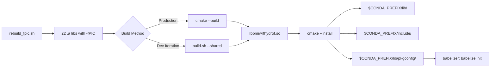

# 🔧 Doc 16: Shared Library, Python C Binding & Babelizer Readiness -- Complete Guide

> **From Fortran to Python in 5 layers** -- This guide covers how we turned the WRF-Hydro BMI wrapper
> (bmi_wrf_hydro.f90) into a shared library (libbmiwrfhydrof.so) callable from Python, and what's
> needed for the babelizer to auto-generate the full Python binding.

---

## 📑 Table of Contents

- [Section 1: 🌟 Introduction & Big Picture](#section-1--introduction--big-picture)
- [Section 2: 🏗️ Architecture Overview](#section-2-️-architecture-overview)
- [Section 3: 🔨 Phase 1 -- fPIC Foundation](#section-3--phase-1----fpic-foundation)
- [Section 4: 📦 Phase 2 -- Shared Library Build](#section-4--phase-2----shared-library-build)
- [Section 5: 🔗 Phase 3 -- Minimal C Binding Layer](#section-5--phase-3----minimal-c-binding-layer)
- [Section 6: 🐍 Python ctypes Usage](#section-6--python-ctypes-usage)
- [Section 7: 🧪 Python Test Suite](#section-7--python-test-suite)
- [Section 8: 🔍 Key Technical Decisions](#section-8--key-technical-decisions)
- [Section 9: 🚀 Babelizer Readiness](#section-9--babelizer-readiness)
- [Section 10: ⚔️ SCHISM Comparison -- Two Paths to Python](#section-10-️-schism-comparison----two-paths-to-python)
- [Section 11: 📊 Performance & Metrics](#section-11--performance--metrics)
- [Section 12: 🛠️ Troubleshooting](#section-12-️-troubleshooting)
- [Section 13: 📁 Complete File Reference](#section-13--complete-file-reference)
- [Section 14: 🗺️ What's Next -- The Babelizer Journey](#section-14-️-whats-next----the-babelizer-journey)
- [Section 15: 📋 Quick Reference Card](#section-15--quick-reference-card)
- [Section 16: 📝 Summary](#section-16--summary)

---

## Section 1: 🌟 Introduction & Big Picture

### 1.1 What This Doc Covers

This document covers the journey from a working Fortran BMI wrapper (`bmi_wrf_hydro.f90`, 1,919 lines, 41 BMI functions) to a **shared library** (`libbmiwrfhydrof.so`, 4.9 MB) that Python can load and call directly. It also documents what the **babelizer** needs from us to auto-generate the full Python package (`pymt_wrfhydro`).

This was accomplished across 4 phases:

| Phase | Name | Key Output |
|-------|------|------------|
| Phase 1 | 🔨 fPIC Foundation | 22 WRF-Hydro static libs rebuilt with `-fPIC` |
| Phase 2 | 📦 Shared Library Build | `libbmiwrfhydrof.so` via CMake + `build.sh --shared` |
| Phase 3 | 🔗 C Binding + Python Tests | 10 `bind(C)` functions + 8 pytest tests |
| Phase 4 | 📄 Documentation | This doc (Doc 16) |

### 1.2 Where We Are in the 5-Layer Architecture

The WRF-Hydro BMI project follows a 5-layer architecture. This document covers **Layer 2.5** -- the bridge between the BMI wrapper (Layer 2) and the babelized Python plugin (Layer 3):

```
┌─────────────────────────────────────────────────────┐
│  Layer 5: Scientist / Jupyter Notebook              │  <-- ~20 lines of Python
├─────────────────────────────────────────────────────┤
│  Layer 4: PyMT Framework                            │  <-- Grid mapping, time sync
├─────────────────────────────────────────────────────┤
│  Layer 3: Babelized Plugin (pymt_wrfhydro)          │  <-- Auto-generated by babelizer
├─────────────═══════════════════════════─────────────┤
│  Layer 2.5: Shared Library + pkg-config             │  <-- ★ THIS DOC ★
│  ┌─────────────────────────────────────────┐        │
│  │ libbmiwrfhydrof.so                      │        │
│  │  ├── bmi_wrf_hydro.f90 (BMI wrapper)    │        │
│  │  ├── bmi_wrf_hydro_c.f90 (C bindings)   │        │
│  │  └── 22 WRF-Hydro static libs (baked in)│        │
│  └─────────────────────────────────────────┘        │
├─────────────────────────────────────────────────────┤
│  Layer 2: BMI Wrappers + Standard Names             │  <-- Doc 15
├─────────────────────────────────────────────────────┤
│  Layer 1: Original Models (WRF-Hydro + SCHISM)      │  <-- Doc 14
└─────────────────────────────────────────────────────┘
```

> 🧠 **Key insight:** Layer 2.5 is the **gateway to Python**. Without a shared library, the babelizer has nothing to wrap. Without pkg-config, the babelizer can't find the library. This layer is small in code but critical in architecture.

### 1.3 ML Analogy

> 🤖 **ML Analogy:** The shared library is like **exporting a trained PyTorch model to ONNX format** -- it packages the model (WRF-Hydro BMI wrapper) so that other frameworks (Python ctypes, babelizer, PyMT) can load and run it without needing the original training code (Fortran compiler, WRF-Hydro source tree).
>
> Just as ONNX standardizes model interchange, the `.so + .pc + .mod` trio standardizes how Fortran BMI models are discovered and loaded by the CSDMS ecosystem.

### 1.4 Prerequisites

Before reading this doc, you should be familiar with:

- **BMI basics** -- What the 41 BMI functions do and why they exist (see **Doc 2**: BMI Complete Detailed Guide)
- **The WRF-Hydro BMI wrapper** -- How `bmi_wrf_hydro.f90` implements the 41 functions (see **Doc 15**: BMI Build & Test Complete Guide)
- **Conda environment** -- The `wrfhydro-bmi` conda environment with gfortran, MPI, NetCDF, and bmi-fortran 2.0.3

### 1.5 Terminology

| Term | Meaning |
|------|---------|
| `.so` | Shared Object -- a dynamically linkable library (Linux equivalent of `.dll` on Windows) |
| `-fPIC` | Position-Independent Code -- compiler flag that makes code relocatable in memory |
| `bind(C)` | Fortran 2003 attribute that exports a function with C-compatible calling convention |
| `pkg-config` | A tool that helps build systems find installed libraries (flags, paths, dependencies) |
| `ctypes` | Python standard library module for calling C-compatible functions in shared libraries |
| Babelizer | CSDMS tool that auto-generates Python bindings for Fortran BMI models |
| PyMT | Python Modeling Toolkit -- CSDMS framework for coupling Earth system models |

---

## Section 2: 🏗️ Architecture Overview

### 2.1 What's in the Shared Library

`libbmiwrfhydrof.so` is a single file that contains **everything** needed to run WRF-Hydro through the BMI interface:

```
libbmiwrfhydrof.so (4.9 MB)
├── bmi_wrf_hydro.f90      BMI wrapper: 41 functions, CSDMS names, grid mapping
├── bmi_wrf_hydro_c.f90    C binding: 10 bind(C) functions for ctypes/testing
├── hydro_stop_shim.f90    Linker shim: resolves bare external symbol
└── 22 WRF-Hydro .a libs   Entire model: Noah-MP, routing, channel, I/O
    ├── libhydro_routing.a
    ├── libnoahmp_util.a
    ├── libhydro_mpp.a
    ├── ... (19 more)
    └── libcrocus_surfex.a
```

The 22 WRF-Hydro static libraries are **baked into** the shared library using `--whole-archive`. This means downstream consumers (Python, babelizer) only need `libbmiwrfhydrof.so` -- no separate WRF-Hydro installation required.

> 🧠 **Key insight:** The shared library is self-contained. A Python script can load it with `ctypes.CDLL("libbmiwrfhydrof.so")` and immediately call BMI functions. No Fortran compiler, no WRF-Hydro source tree, no additional `.a` files needed at runtime.

### 2.2 Why a Shared Library?

Static libraries (`.a`) require the consumer to recompile and relink. Shared libraries (`.so`) enable **dynamic loading** at runtime:

| Feature | Static Library (`.a`) | Shared Library (`.so`) |
|---------|----------------------|------------------------|
| Loading | Compile-time only | Runtime (`dlopen`, `ctypes.CDLL`) |
| Consumer language | Same language (Fortran) | Any language with FFI (Python, C, C++) |
| Babelizer | Cannot use | Required (`pkg-config --libs`) |
| File size | One `.a` per module | Single self-contained file |
| Symbol visibility | Internal | Exported (visible to `nm -D`) |

> 🤖 **ML Analogy:** Static library = source code you must compile with your project (like training from scratch). Shared library = pre-compiled model checkpoint you just load (like `torch.load("model.pt")`).

### 2.3 File Inventory

| File | Lines | Purpose | Phase Created |
|------|-------|---------|---------------|
| `bmi_wrf_hydro.f90` | 1,919 | Main BMI wrapper (41 functions) | Pre-existing |
| `bmi_wrf_hydro_c.f90` | 335 | C binding layer (10 functions) | Phase 3 |
| `hydro_stop_shim.f90` | 28 | Linker symbol resolver | Phase 2 |
| `CMakeLists.txt` | 447 | CMake build configuration | Phase 2 |
| `bmiwrfhydrof.pc.cmake` | 11 | pkg-config template | Phase 2 |
| `rebuild_fpic.sh` | ~80 | Rebuild WRF-Hydro with -fPIC | Phase 1 |
| `build.sh` (updated) | ~250 | Dev builds with --fpic/--shared | Phase 1-2 |
| `conftest.py` | 181 | Pytest fixtures | Phase 3 |
| `test_bmi_python.py` | 312 | Python test suite (8 tests) | Phase 3 |

### 2.4 Build Pipeline Flow



The pipeline has two paths:

1. **Production (CMake):** Full project build with proper versioning, installation, and pkg-config generation. Use this for the final library that babelizer consumes.
2. **Development (`build.sh --shared`):** Quick iteration during development. Skips cmake overhead, builds directly with gfortran, auto-runs tests.

---

## Section 3: 🔨 Phase 1 -- fPIC Foundation

### 3.1 What is -fPIC and Why It's Needed

Every piece of code that goes into a shared library must be compiled as **Position-Independent Code** (PIC). Without it, the code assumes it will be loaded at a fixed memory address, which conflicts with shared library loading.

The `-fPIC` flag tells the compiler to generate code that works correctly regardless of where in memory it ends up:

```
Without -fPIC:                     With -fPIC:
┌──────────────────┐              ┌──────────────────┐
│ Code at 0x400000 │              │ Code at ANY addr  │
│ MOV 0x400100, %eax│             │ MOV [RIP+0x100]  │
│ (absolute addr)  │              │ (relative addr)   │
└──────────────────┘              └──────────────────┘
    ✗ Fails in .so                    ✓ Works in .so
```

> 🤖 **ML Analogy:** -fPIC is like making your code **containerized** -- it can run at any address (like a Docker container on any host), rather than being hardcoded to a specific machine (like a bare-metal install). A shared library is like a container image: it must be portable.

### 3.2 How rebuild_fpic.sh Works

WRF-Hydro's original build (`wrf_hydro_nwm_public/build/`) was compiled **without** explicit `-fPIC`. We cannot modify WRF-Hydro's CMakeLists.txt (non-invasive rule), so we created a wrapper script:

```bash
# rebuild_fpic.sh -- Rebuild WRF-Hydro with explicit -fPIC
cmake .. \
  -DCMAKE_BUILD_TYPE=Release \
  -DCMAKE_POSITION_INDEPENDENT_CODE=ON \    # <-- The key flag
  -DCMAKE_Fortran_COMPILER=gfortran \
  -DCMAKE_C_COMPILER=gcc \
  -DCMAKE_CXX_COMPILER=g++

make -j$(nproc)
```

The flag `CMAKE_POSITION_INDEPENDENT_CODE=ON` tells CMake to add `-fPIC` to all **library** targets. This produces 22 static libraries in `build_fpic/lib/` alongside the original `build/lib/`:

```
wrf_hydro_nwm_public/
├── build/           # Original build (no explicit -fPIC)
│   └── lib/         # 22 .a files (may have R_X86_64_32S relocations)
├── build_fpic/      # fPIC rebuild
│   ├── lib/         # 22 .a files (zero R_X86_64_32S relocations) ✓
│   └── mods/        # .mod files from fPIC build
└── src/             # WRF-Hydro source (untouched)
```

### 3.3 Verification

To verify that all relocations are PIC-compatible (no absolute 32-bit addresses):

```bash
# Count problematic relocations (should be 0 for each library)
for lib in wrf_hydro_nwm_public/build_fpic/lib/*.a; do
  count=$(readelf -r "$lib" 2>/dev/null | grep -c R_X86_64_32S)
  echo "$count  $(basename $lib)"
done
```

All 22 libraries should show `0` -- meaning no absolute 32-bit relocations that would break shared library loading.

### 3.4 Key Decision

> 📌 **Decision:** Used conda gfortran 14.3.0 (not system gfortran 13.3.0) for the fPIC rebuild. This aligns the compiler version between WRF-Hydro libraries and our BMI wrapper, preventing ABI incompatibility.

---

## Section 4: 📦 Phase 2 -- Shared Library Build

Phase 2 provides two ways to build `libbmiwrfhydrof.so`: `build.sh --shared` for fast development iteration, and CMake for production installation.

### 4.1 build.sh --shared (Dev Workflow)

The `--shared` flag in `build.sh` builds the shared library directly with gfortran:

```bash
# Build .so + full test suite linked against .so + auto-run tests
./build.sh --shared full

# Build .so + minimal test linked against .so + auto-run tests
./build.sh --shared minimal

# Build .so + all tests + auto-run all
./build.sh --shared
```

Internally, `--shared` auto-implies `--fpic` (uses `build_fpic/` libraries) and performs these steps:

1. **Compile** BMI wrapper + C bindings + shim with `-fPIC`
2. **Recompile** two WRF-Hydro driver `.F` files with explicit `-fPIC` (see Section 4.3 below)
3. **Link** everything into `libbmiwrfhydrof.so` via `gfortran -shared` with `--whole-archive`
4. **Link** test executables against the `.so` using `-rpath`
5. **Auto-run** tests and report pass/fail

> 📌 **Why gfortran -shared, not mpif90 -shared?** The `mpif90` wrapper can strip or mangle linker flags like `--whole-archive`. We extract MPI flags with `mpif90 --showme:link` and pass them directly to `gfortran`.

### 4.2 CMakeLists.txt (Production Workflow)

The `CMakeLists.txt` is a 447-line file that builds and installs the shared library following the `bmi-example-fortran` pattern. It has 12 sections:

| # | Section | Purpose |
|---|---------|---------|
| 1 | Project Setup | Name (`bmi-wrf-hydro`), version (1.0.0), Fortran language |
| 2 | Find BMI Fortran | `pkg_check_modules(BMIF)` -- locates `libbmif.so` + `bmif_2_0.mod` |
| 3 | Find MPI | `find_package(MPI)` -- needed for WRF-Hydro symbol resolution |
| 4 | Find WRF-Hydro fPIC libs | Locates all 22 `.a` files in `build_fpic/lib/` |
| 5 | Preprocessor definitions | `-DWRF_HYDRO -DMPP_LAND` (match WRF-Hydro's build) |
| 6 | Compiler flags | Per-compiler (gfortran vs Intel), `-fPIC`, `-cpp`, etc. |
| 7 | **Shared library target** | `add_library(SHARED)` with `--whole-archive` linking |
| 8 | Test executable | Links against `libbmiwrfhydrof.so` |
| 9 | CTest registration | `ctest --test-dir _build` to run 151-test suite |
| 10 | Installation rules | `.so` to `lib/`, `.mod` to `include/`, `.pc` to `lib/pkgconfig/` |
| 11 | pkg-config generation | `configure_file()` substitutes version, paths into `.pc` template |
| 12 | Build summary | Status messages showing what was found and configured |

Build and install commands:

```bash
# Activate conda environment
source ~/miniconda3/etc/profile.d/conda.sh && conda activate wrfhydro-bmi

# Configure (generates Makefile from CMakeLists.txt)
cd bmi_wrf_hydro
cmake -B _build -DCMAKE_INSTALL_PREFIX=$CONDA_PREFIX

# Build (compiles everything, produces libbmiwrfhydrof.so)
cmake --build _build

# Test (runs 151-test suite via CTest)
ctest --test-dir _build

# Install (copies .so, .mod, .pc to conda prefix)
cmake --install _build
```

> 📌 **Key Decision:** Library named **`bmiwrfhydrof`** (not `wrfhydro_bmi` or `wrf_hydro_bmi`). This follows the bmi-example-fortran convention: `bmi{model}f` where `f` stands for Fortran. The babelizer expects this naming pattern.

### 4.3 The -fPIE vs -fPIC Problem

One of the trickiest discoveries during Phase 2 was that CMake's `CMAKE_POSITION_INDEPENDENT_CODE=ON` behaves differently for **library** targets vs **executable** targets:

```
CMake POSITION_INDEPENDENT_CODE = ON:
┌────────────────────────┬────────────────────────┐
│   Library Targets      │   Executable Targets   │
│   add_library(SHARED)  │   add_executable()     │
│   Compiler flag: -fPIC │   Compiler flag: -fPIE │
│   ✓ Works in .so       │   ✗ Fails in .so       │
└────────────────────────┴────────────────────────┘
```

WRF-Hydro's `module_NoahMP_hrldas_driver.F` and `module_hrldas_netcdf_io.F` are compiled as part of the `wrfhydro` **executable** target, so their `.o` files have `-fPIE` (not `-fPIC`). They cannot be linked into our shared library.

**Solution:** Include the `.F` source files directly in our `add_library(SHARED ...)` target, which recompiles them with `-fPIC`:

```cmake
add_library(${bmi_name} SHARED
  src/bmi_wrf_hydro.f90           # Our BMI wrapper
  src/bmi_wrf_hydro_c.f90         # Our C bindings
  src/hydro_stop_shim.f90         # Our linker shim
  ${WRF_IO_SRC_DIR}/module_NoahMP_hrldas_driver.F    # Recompiled with -fPIC
  ${WRF_IO_SRC_DIR}/module_hrldas_netcdf_io.F        # Recompiled with -fPIC
)
```

> 🧠 **Key insight:** This is why we **recompile from source** instead of linking pre-built `.o` files. CMake's `-fPIC` flag applies to the target we're building, not to pre-built objects we link against.

### 4.4 The hydro_stop_shim.f90 Story

When building with `--whole-archive`, **all** object files from the 22 static libraries are pulled into the shared library, including dead code that's normally excluded by selective linking.

One piece of dead code in `module_reservoir_routing.F90` calls `hydro_stop()` **without** a `use module_hydro_stop` statement:

```fortran
! In module_reservoir_routing.F90 (WRF-Hydro source, NOT our code):
subroutine nwmCheck(...)
  ! Missing: use module_hydro_stop
  call hydro_stop("Error: ...")   ! Generates bare symbol hydro_stop_
end subroutine
```

This generates a reference to the bare external symbol `hydro_stop_`, while the actual function lives in `module_hydro_stop` with the mangled symbol `__module_hydro_stop_MOD_hydro_stop`. The linker can't connect them.

**Solution:** `hydro_stop_shim.f90` provides the bare external symbol and delegates to the module version:

```fortran
! hydro_stop_shim.f90 -- 28 lines total
subroutine hydro_stop(msg)
  use module_hydro_stop, only: HYDRO_stop_mod => HYDRO_stop
  implicit none
  character(len=*), intent(in) :: msg
  call HYDRO_stop_mod(msg)
end subroutine hydro_stop
```

> 🤖 **ML Analogy:** The shim is like a **thin adapter class** that forwards calls from one interface to another -- like a PyTorch `nn.Module` wrapper that just calls `self.inner_model.forward(x)`. It exists because two callers expect different names for the same function.

### 4.5 pkg-config Discovery

The babelizer finds our shared library using `pkg-config`. The `.pc` file is a simple 11-line template:

```
prefix=/home/mohansai/miniconda3/envs/wrfhydro-bmi
exec_prefix=${prefix}
libdir=${exec_prefix}/lib
includedir=${prefix}/include

Name: bmiwrfhydrof
Description: BMI for WRF-Hydro hydrological model
Version: 1.0.0
Requires: bmif
Libs: -L${libdir} -lbmiwrfhydrof
Cflags: -I${includedir}
```

Key fields:
- **`Requires: bmif`** -- Our library depends on `libbmif.so` (BMI Fortran spec). No WRF-Hydro `.pc` needed because the 22 static libs are baked into our `.so`.
- **`Libs: -lbmiwrfhydrof`** -- Tells consumers to link against our library.
- **`Cflags: -I${includedir}`** -- Points to `.mod` files for Fortran `use` statements.

Verification commands:

```bash
# Check if pkg-config can find our library
pkg-config --libs bmiwrfhydrof
# Expected: -L/home/.../lib -lbmiwrfhydrof -lbmif

# Check version
pkg-config --modversion bmiwrfhydrof
# Expected: 1.0.0

# Check include path
pkg-config --cflags bmiwrfhydrof
# Expected: -I/home/.../include
```

> 🧠 **Key insight:** The babelizer's Meson build system uses `dependency('bmiwrfhydrof', method: 'pkg-config')` to discover our library. If this command fails, the babelizer cannot generate the Python package.

---

## Section 5: 🔗 Phase 3 -- Minimal C Binding Layer

### 5.1 Why Minimal? (The Babelizer Insight)

The BMI spec has 41 functions. Our C binding layer wraps only **10** of them. Why?

Because the **babelizer auto-generates** a complete 818-line `bmi_interoperability.f90` file with full ISO_C_BINDING wrappers for all 41 BMI functions. Our C bindings are **test infrastructure** -- they exist to validate that `libbmiwrfhydrof.so` works from Python **before** we run the babelizer.

```
┌──────────────────────────────┐    ┌──────────────────────────────┐
│  OUR C BINDINGS              │    │  BABELIZER'S INTEROP LAYER   │
│  (bmi_wrf_hydro_c.f90)      │    │  (bmi_interoperability.f90)  │
│                              │    │                              │
│  10 functions                │    │  41+ functions               │
│  335 lines                   │    │  818 lines                   │
│  Test infrastructure         │    │  Production code             │
│  Validates .so works         │    │  Full Python binding         │
│  Written by us               │    │  Auto-generated              │
└──────────────────────────────┘    └──────────────────────────────┘
         ↑ We wrote this                    ↑ Babelizer writes this
```

> 🤖 **ML Analogy:** Our C bindings are like a **quick smoke test** you run on a model before deploying it to production. The babelizer's interop layer is the **full inference API** with all endpoints, error handling, and serialization. You don't write the production API by hand if a framework can generate it.

### 5.2 The Singleton Pattern

WRF-Hydro cannot support multiple instances. Its module-level globals (arrays like `COSZEN`, `SMOIS`, etc.) are allocated once during initialization and cannot be re-allocated without modifying WRF-Hydro source code. This means:

- There can only be **one** BMI model instance per process
- The model instance lives at the **module level**, not on the heap
- A **guard flag** prevents double registration

```fortran
module bmi_wrf_hydro_c_mod
  use bmiwrfhydrof, only: bmi_wrf_hydro
  use, intrinsic :: iso_c_binding
  implicit none
  private

  ! Singleton instance (module-level, SAVE by default in F2003)
  type(bmi_wrf_hydro), save, target :: the_model

  ! Guard flag -- once registered, cannot register again
  logical, save :: is_registered = .false.

contains

  function bmi_register() result(status) bind(C, name="bmi_register")
    integer(c_int) :: status
    if (is_registered) then
      status = BMI_FAILURE  ! Already registered
      return
    end if
    is_registered = .true.
    status = BMI_SUCCESS
  end function bmi_register
```

**Contrast with SCHISM's box/opaque-handle pattern:**

SCHISM (LynkerIntel's `bmischism.f90`) uses a `register_bmi` function that allocates a "box" on the heap and returns an opaque handle. This supports multiple instances in theory (though SCHISM also can't truly multi-instance). The box pattern is required by **NOAA NextGen**, which is SCHISM's target framework.

We don't need the box pattern because our target is **PyMT/babelizer**, which works with module-level singletons.

### 5.3 The 10 bind(C) Functions

All 10 functions are exposed as flat C symbols callable from Python `ctypes`:

| # | C Symbol Name | Fortran BMI Equivalent | Parameters | Return |
|---|---------------|----------------------|------------|--------|
| 1 | `bmi_register` | *(singleton guard)* | none | `c_int` |
| 2 | `bmi_initialize` | `the_model%initialize(config_file)` | `c_char(*)` | `c_int` |
| 3 | `bmi_update` | `the_model%update()` | none | `c_int` |
| 4 | `bmi_finalize` | `the_model%finalize()` | none | `c_int` |
| 5 | `bmi_get_component_name` | `the_model%get_component_name(name)` | `c_char(n), c_int` | `c_int` |
| 6 | `bmi_get_current_time` | `the_model%get_current_time(time)` | `c_double*` | `c_int` |
| 7 | `bmi_get_var_grid` | `the_model%get_var_grid(name, grid)` | `c_char(*), c_int*` | `c_int` |
| 8 | `bmi_get_grid_size` | `the_model%get_grid_size(grid, size)` | `c_int, c_int*` | `c_int` |
| 9 | `bmi_get_var_nbytes` | `the_model%get_var_nbytes(name, nbytes)` | `c_char(*), c_int*` | `c_int` |
| 10 | `bmi_get_value_double` | `the_model%get_value_double(name, dest)` | `c_char(*), c_double(*)` | `c_int` |

**Grouped by category:**

- **Lifecycle (4):** `bmi_register`, `bmi_initialize`, `bmi_update`, `bmi_finalize`
- **Model info (1):** `bmi_get_component_name`
- **Time (1):** `bmi_get_current_time`
- **Grid/Variable (3):** `bmi_get_var_grid`, `bmi_get_grid_size`, `bmi_get_var_nbytes`
- **Data (1):** `bmi_get_value_double`

All functions return `integer(c_int)` status: `BMI_SUCCESS = 0` or `BMI_FAILURE = 1`.

### 5.4 String Marshalling

C and Fortran handle strings differently. C strings are null-terminated arrays of `char`. Fortran strings are fixed-length, space-padded. Two helper functions handle the conversion:

**`c_to_f_string` -- C string to Fortran string:**

```fortran
pure function c_to_f_string(c_string) result(f_string)
  character(kind=c_char, len=1), intent(in) :: c_string(*)
  character(len=:), allocatable :: f_string
  integer :: i, n

  ! Step 1: Find the null terminator
  i = 1
  do while (c_string(i) /= c_null_char)
    i = i + 1
  end do
  n = i - 1

  ! Step 2: Allocate and copy character by character
  allocate(character(len=n) :: f_string)
  do i = 1, n
    f_string(i:i) = c_string(i)
  end do
end function c_to_f_string
```

**`f_to_c_string` -- Fortran string to C buffer:**

```fortran
pure subroutine f_to_c_string(f_string, c_string, c_len)
  character(len=*), intent(in) :: f_string
  integer(c_int), intent(in) :: c_len
  character(kind=c_char, len=1), intent(out) :: c_string(c_len)
  integer :: i, n

  n = len_trim(f_string)
  if (n > c_len - 1) n = c_len - 1  ! Leave room for null terminator

  do i = 1, n
    c_string(i) = f_string(i:i)
  end do
  c_string(n + 1) = c_null_char
end subroutine f_to_c_string
```

> 📌 **Why character-by-character copy (not `transfer()`)?** The Fortran `transfer()` intrinsic can produce incorrect results with some compilers (particularly gfortran) when converting between `character(kind=c_char)` arrays and `character(len=N)` scalars. The loop is safe and portable.

> 📌 **Why is `f_to_c_string` a subroutine (not a function)?** If it were a function returning a `c_char` array, the caller would need to know the array size at compile time. As a subroutine with a caller-provided buffer and length parameter, it avoids stack overflow with large strings and gives the caller control over memory.

---

## Section 6: 🐍 Python ctypes Usage

### 6.1 Loading the Shared Library

Loading `libbmiwrfhydrof.so` from Python requires three steps:

```python
import ctypes
import os

conda_prefix = os.environ["CONDA_PREFIX"]

# Step 1: RTLD_GLOBAL preload of libmpi.so (Open MPI requirement)
libmpi = ctypes.CDLL(
    os.path.join(conda_prefix, "lib", "libmpi.so"),
    ctypes.RTLD_GLOBAL
)

# Step 2: Load our BMI shared library
lib = ctypes.CDLL(
    os.path.join(conda_prefix, "lib", "libbmiwrfhydrof.so")
)

# Step 3: Configure function signatures (restype and argtypes)
lib.bmi_register.restype = ctypes.c_int
lib.bmi_register.argtypes = []

lib.bmi_initialize.restype = ctypes.c_int
lib.bmi_initialize.argtypes = [ctypes.c_char_p]

lib.bmi_update.restype = ctypes.c_int
lib.bmi_update.argtypes = []

lib.bmi_finalize.restype = ctypes.c_int
lib.bmi_finalize.argtypes = []

lib.bmi_get_component_name.restype = ctypes.c_int
lib.bmi_get_component_name.argtypes = [ctypes.c_char_p, ctypes.c_int]

lib.bmi_get_current_time.restype = ctypes.c_int
lib.bmi_get_current_time.argtypes = [ctypes.POINTER(ctypes.c_double)]

lib.bmi_get_var_grid.restype = ctypes.c_int
lib.bmi_get_var_grid.argtypes = [ctypes.c_char_p, ctypes.POINTER(ctypes.c_int)]

lib.bmi_get_grid_size.restype = ctypes.c_int
lib.bmi_get_grid_size.argtypes = [ctypes.c_int, ctypes.POINTER(ctypes.c_int)]

lib.bmi_get_var_nbytes.restype = ctypes.c_int
lib.bmi_get_var_nbytes.argtypes = [ctypes.c_char_p, ctypes.POINTER(ctypes.c_int)]

lib.bmi_get_value_double.restype = ctypes.c_int
lib.bmi_get_value_double.argtypes = [ctypes.c_char_p, ctypes.POINTER(ctypes.c_double)]
```

### 6.2 The MPI Preload Pattern

Open MPI 5.0.8 uses a **plugin system** (`dlopen`) to load its internal components (BTL transport, PML matching, etc.). These plugins reference symbols from `libmpi.so`. By default, `ctypes.CDLL` loads libraries with `RTLD_LOCAL`, making their symbols invisible to subsequently loaded libraries.

Without `RTLD_GLOBAL`, the sequence fails:

```
1. ctypes.CDLL("libbmiwrfhydrof.so")  # Loads MPI symbols as LOCAL
2. MPI_Init() inside bmi_initialize    # MPI tries to dlopen plugins
3. Plugin needs MPI_Comm_rank          # Symbol not found -> SEGFAULT
```

With `RTLD_GLOBAL`, MPI symbols are visible globally:

```
1. ctypes.CDLL("libmpi.so", RTLD_GLOBAL)  # MPI symbols are GLOBAL ✓
2. ctypes.CDLL("libbmiwrfhydrof.so")       # Our library loads fine
3. MPI_Init() inside bmi_initialize         # Plugins find MPI symbols ✓
```

> 🤖 **ML Analogy:** This is like importing a base library before the extension -- you must `import tensorflow` before `import tf.keras` because keras depends on TF symbols being in scope. Similarly, MPI must be globally loaded before our library initializes it.

### 6.3 Data Flow: Python to Fortran

When a Python script calls `bmi_get_value_double`, the call travels through four layers:

```
Python: lib.bmi_get_value_double(b"channel_water__volume_flow_rate", arr_ptr)
  │
  ▼ ctypes FFI (Foreign Function Interface)
C ABI: bmi_get_value_double(name, dest) in libbmiwrfhydrof.so
  │
  ▼ bind(C) wrapper (bmi_wrf_hydro_c.f90)
Fortran: the_model%get_value_double("channel_water__volume_flow_rate", dest_array)
  │
  ▼ BMI wrapper (bmi_wrf_hydro.f90)
WRF-Hydro state: rt_domain(1)%QLINK(:,1) --> copied to dest_array as double
```

The reverse flow for `set_value` is similar but writes data into WRF-Hydro's state arrays.

**Complete example -- retrieving streamflow from Python:**

```python
import ctypes
import numpy as np

# (After loading library and initializing -- see conftest.py)

# 1. Query grid ID for the streamflow variable
grid_id = ctypes.c_int()
lib.bmi_get_var_grid(b"channel_water__volume_flow_rate", ctypes.byref(grid_id))

# 2. Query grid size using that ID
grid_size = ctypes.c_int()
lib.bmi_get_grid_size(grid_id, ctypes.byref(grid_size))

# 3. Allocate a numpy array of the right size
values = np.zeros(grid_size.value, dtype=np.float64)

# 4. Pass the array's data pointer to the Fortran function
values_ptr = values.ctypes.data_as(ctypes.POINTER(ctypes.c_double))
lib.bmi_get_value_double(b"channel_water__volume_flow_rate", values_ptr)

# 5. Use the values in Python
print(f"Max streamflow: {values.max():.4f} m3/s")
print(f"Active channels: {np.sum(values > 0)}")
```

> 🧠 **Key insight:** All array sizes are queried **dynamically** from BMI functions. The Python code has zero hardcoded grid dimensions. This means the same code works for any WRF-Hydro domain (Croton NY, Delaware River, Mississippi Basin, full NWM).

---

## Section 7: 🧪 Python Test Suite

### 7.1 Test Architecture

The Python test suite uses **session-scoped** pytest fixtures because WRF-Hydro is a singleton -- it cannot be re-initialized within the same process. All 8 tests share a single BMI session:

```
Fixture Dependency Chain:
┌──────────────────────────────────────────────────┐
│  libmpi (session)                                │
│  └── Load libmpi.so with RTLD_GLOBAL            │
│      └── bmi_lib (session)                       │
│          └── Load libbmiwrfhydrof.so             │
│          └── Set restype/argtypes for 10 funcs   │
│              └── bmi_config_file (session)        │
│                  └── Write BMI namelist to tmpdir │
│                      └── bmi_session (session)    │
│                          └── register()           │
│                          └── initialize()         │
│                          └── yield lib            │
│                          └── finalize() (teardown)│
│                          └── MPI_Finalize()       │
└──────────────────────────────────────────────────┘
```

Two pytest markers control test selection:
- **`@pytest.mark.smoke`** -- Quick tests (1-2 timesteps, ~8-9 seconds total). Run with `-m smoke`.
- **`@pytest.mark.full`** -- Full 6-hour simulation tests (~17 seconds total). Run without marker filter.

### 7.2 The 8 Tests

| # | Test Name | Marker | Validates | Key Assertion |
|---|-----------|--------|-----------|---------------|
| 1 | `test_register_singleton` | smoke | Singleton guard | Second `bmi_register()` returns `BMI_FAILURE` |
| 2 | `test_component_name` | smoke | Component name string | `"WRF-Hydro v5.4.0 (NCAR)"` |
| 3 | `test_initial_time` | smoke | Time before any updates | `time == 0.0` |
| 4 | `test_smoke_update_and_time` | smoke | Time advances after update | `time > 0.0` |
| 5 | `test_smoke_get_grid_size_dynamic` | smoke | Dynamic sizing | `size > 0`, `nbytes == size * 8` |
| 6 | `test_smoke_get_streamflow` | smoke | Data retrieval works | At least some values `>= 0` |
| 7 | `test_full_6hour_streamflow_evolution` | full | Croton NY match | Values evolve over 6 hours |
| 8 | `test_full_streamflow_physical_range` | full | Physical validity | All `>= -1e-6`, max `< 1e6` |

### 7.3 Running the Tests

```bash
# Activate conda environment
source ~/miniconda3/etc/profile.d/conda.sh && conda activate wrfhydro-bmi

# Quick smoke test (6 tests, ~8-9 seconds)
cd bmi_wrf_hydro && python -m pytest tests/test_bmi_python.py -m smoke -v

# Full test suite (8 tests, ~17 seconds)
cd bmi_wrf_hydro && python -m pytest tests/test_bmi_python.py -v

# If MPI requires mpirun for initialization
cd bmi_wrf_hydro && mpirun --oversubscribe -np 1 python -m pytest tests/test_bmi_python.py -v
```

Expected output (full run):

```
tests/test_bmi_python.py::test_register_singleton PASSED
tests/test_bmi_python.py::test_component_name PASSED
tests/test_bmi_python.py::test_initial_time PASSED
tests/test_bmi_python.py::test_smoke_update_and_time PASSED
tests/test_bmi_python.py::test_smoke_get_grid_size_dynamic PASSED
tests/test_bmi_python.py::test_smoke_get_streamflow PASSED
tests/test_bmi_python.py::test_full_6hour_streamflow_evolution PASSED
tests/test_bmi_python.py::test_full_streamflow_physical_range PASSED

========================= 8 passed in 16.79s =========================
```

> 📌 **Note on negative streamflow:** WRF-Hydro stores values as `REAL` (32-bit float) internally. The BMI wrapper converts to `double` (64-bit). This conversion introduces tiny negative noise (~-2e-11). The physical range check uses `-1e-6` tolerance (not strict `>= 0`) to accommodate this noise while still catching real errors.

---

## Section 8: 🔍 Key Technical Decisions

This section consolidates all key decisions made across Phases 1-3 into a decision log for reference.

| # | Decision | Alternatives Considered | Rationale | Where in Code |
|---|----------|------------------------|-----------|---------------|
| 1 | Library named `bmiwrfhydrof` | `wrfhydro_bmi`, `wrf_hydro_bmi` | bmi-example-fortran convention (`bmi{model}f`), babelizer expects this | `CMakeLists.txt` line 70, `set(bmi_name bmiwrfhydrof)` |
| 2 | Minimal C bindings (10 not 41) | Full 41-function C binding layer | Babelizer auto-generates full 818-line interop layer; our bindings are test-only | `bmi_wrf_hydro_c.f90` (entire file) |
| 3 | Singleton pattern | Box/opaque-handle (SCHISM's approach) | WRF-Hydro can't multi-instance (module globals); box pattern is for NextGen | `bmi_wrf_hydro_c.f90` lines 61-67 |
| 4 | `gfortran -shared` (not `mpif90`) | `mpif90 -shared` | mpif90 wrapper can strip `--whole-archive` flags | `build.sh` shared library link step |
| 5 | Recompile `.F` sources in CMake | Link pre-built `.o` files from `build_fpic/` | `CMAKE_POSITION_INDEPENDENT_CODE` only applies to library targets (-fPIC), not executable targets (-fPIE) | `CMakeLists.txt` lines 274-280 |
| 6 | `--whole-archive` linking | Selective linking (`--start-group`) | All symbols must be available in .so for downstream consumers | `CMakeLists.txt` lines 301-309 |
| 7 | `hydro_stop_shim.f90` | Modify WRF-Hydro source (rejected: non-invasive rule) | Bare external `hydro_stop_` from dead code exposed by --whole-archive | `src/hydro_stop_shim.f90` (28 lines) |
| 8 | `RTLD_GLOBAL` for MPI preload | `mpi4py` import, `LD_PRELOAD` env var | Simplest approach, works with ctypes, no extra dependency | `conftest.py` line 53 |
| 9 | Session-scoped pytest | Per-test BMI lifecycle | WRF-Hydro singleton prevents re-init; all tests share one session | `conftest.py` line 139 |
| 10 | `-1e-6` streamflow tolerance | Strict `>= 0.0` | `REAL` to `double` conversion introduces ~-2e-11 noise | `test_bmi_python.py` line 296 |

> 🧠 **Key insight:** Decisions 1-3 are **architectural** (affect the babelizer pathway). Decisions 4-7 are **build system** workarounds (Linux/Fortran quirks). Decisions 8-10 are **testing** pragmatics (MPI + singleton constraints). Understanding why each decision was made helps when extending the system.

